# 시스템 아키텍처 (System Architecture)
{: .no_toc }

CI Hub 시스템의 전체 구조와 기술 스택을 정의합니다.
{: .fs-6 .fw-300 }

---

## 목차
{: .no_toc .text-delta }

1. TOC
{:toc}

---

## 1. 전체 시스템 아키텍처

### 1.1 시스템 컨텍스트 (C4 Level 1)

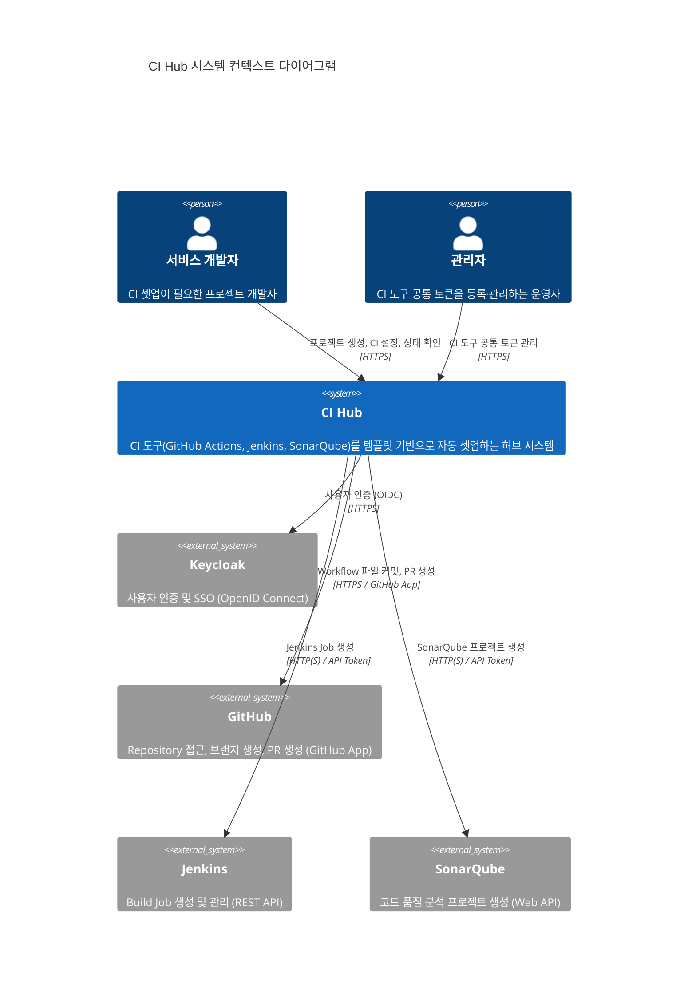

### 1.2 컨테이너 다이어그램 (C4 Level 2)

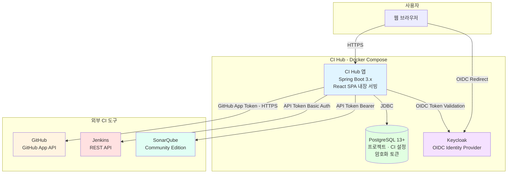

**핵심 설계 결정**: React SPA 빌드 결과물을 Spring Boot가 Static Resource로 서빙합니다. 별도 Nginx 또는 CDN 없이 단일 컨테이너로 프론트엔드와 백엔드를 함께 제공합니다.

---

## 2. 레이어 아키텍처

### 2.1 레이어 구조

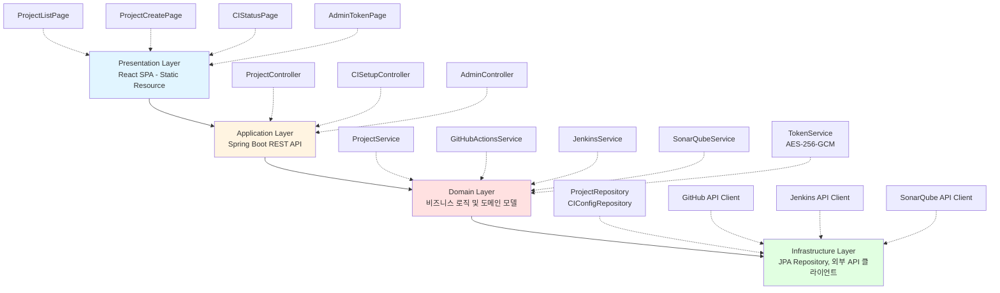

### 2.2 레이어별 책임

| 레이어 | 책임 | 기술 |
|--------|------|------|
| **Presentation** | React SPA 렌더링, 사용자 입력 처리 (Spring Boot가 정적 파일 서빙) | React 18+, TypeScript, React Router |
| **Application** | REST API 엔드포인트, 인증/인가 검증, 입력 유효성 검사 | Spring Boot, Spring Security, Bean Validation |
| **Domain** | 프로젝트 관리, CI 설정 오케스트레이션, 토큰 암호화·복호화 | Kotlin, Domain Services |
| **Infrastructure** | DB 접근, 외부 API(GitHub/Jenkins/SonarQube/Keycloak) 호출 | Spring Data JPA, RestTemplate/WebClient |

---

## 3. 기술 스택

### 3.1 전체 기술 스택

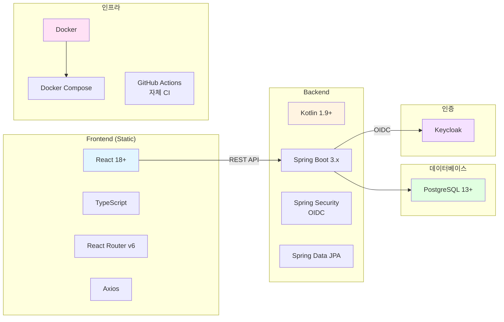

### 3.2 상세 기술 스택

#### Frontend

| 구분 | 기술 | 버전 | 용도 |
|------|------|------|------|
| 프레임워크 | React | 18.x | UI 라이브러리 |
| 언어 | TypeScript | 5.x | 타입 안정성 |
| 라우팅 | React Router | 6.x | SPA 클라이언트 라우팅 |
| HTTP 클라이언트 | Axios | 1.x | REST API 호출 |
| 빌드 | Vite / CRA | - | 번들링 및 정적 파일 생성 |

#### Backend

| 구분 | 기술 | 버전 | 용도 |
|------|------|------|------|
| 언어 | Kotlin | 1.9+ | JVM 기반 백엔드 언어 |
| 프레임워크 | Spring Boot | 3.x | 애플리케이션 서버 |
| 인증/인가 | Spring Security + OAuth2 Resource Server | - | Keycloak JWT 검증 |
| ORM | Spring Data JPA + Hibernate | - | 데이터베이스 접근 |
| API 문서 | SpringDoc OpenAPI (Swagger UI) | 2.x | REST API 문서화 |
| 암호화 | JDK AES-256-GCM | - | CI 도구 토큰 암호화 |
| 검증 | Bean Validation (jakarta.validation) | - | 입력 유효성 검사 |
| HTTP 클라이언트 | Spring WebClient / RestTemplate | - | 외부 API 호출 |
| 정적 파일 서빙 | Spring Boot Static Resource Handler | - | React SPA 내장 서빙 |
| 모니터링 | Spring Boot Actuator | - | 헬스 체크, 메트릭 |

#### Database 및 인증

| 구분 | 기술 | 버전 | 용도 |
|------|------|------|------|
| RDBMS | PostgreSQL | 13+ | 주 데이터베이스 (프로젝트, CI 설정, 토큰) |
| 인증 서버 | Keycloak | 21+ | OIDC Identity Provider |

#### DevOps 및 Infrastructure

| 구분 | 기술 | 버전 | 용도 |
|------|------|------|------|
| 컨테이너 | Docker | 24.x | 컨테이너화 |
| 오케스트레이션 | Docker Compose | 3.8+ | 로컬/운영 환경 구성 |
| CI/CD | GitHub Actions | - | 프로젝트 자체 CI 파이프라인 |
| 로깅 | Logback + JSON encoder | - | 구조화된 JSON 로그 |
| 코드 분석 | ktlint, detekt / ESLint, Prettier | - | 정적 코드 분석 |

---

## 4. 배포 아키텍처

### 4.1 Docker Compose 구성

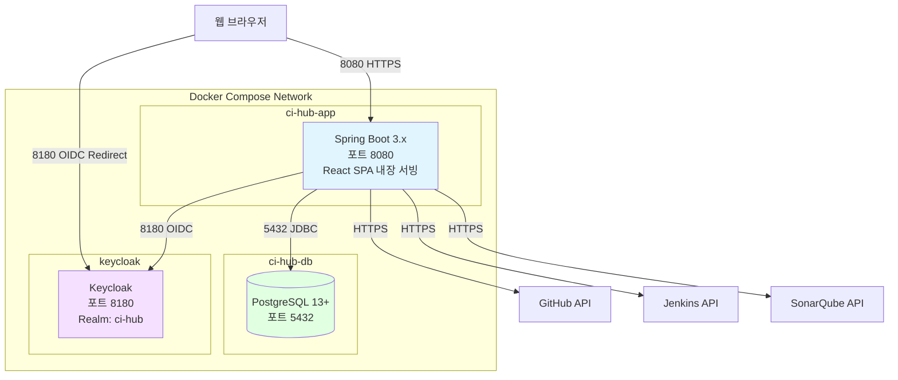

### 4.2 환경별 구성

| 환경 | 용도 | 구성 | 비고 |
|------|------|------|------|
| **Local Development** | 개발자 로컬 | Docker Compose (전체 스택) | `.env.local` |
| **CI (GitHub Actions)** | PR 빌드/테스트 | 단위 테스트 + 통합 테스트 | `docker-compose.test.yml` |
| **Production** | 운영 | Docker Compose (단일 서버) | `.env.production` |

### 4.3 Spring Boot Static Resource 서빙 구조

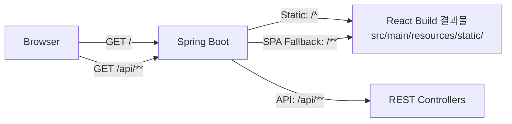

- React 빌드 결과물은 `src/main/resources/static/`에 복사하여 내장 서빙
- `/api/**` 경로는 Spring Boot REST Controller가 처리
- 그 외 모든 경로(`/**`)는 `index.html`로 폴백하여 React Router가 처리

---

## 5. 데이터 흐름

### 5.1 GitHub Actions Workflow 생성 흐름

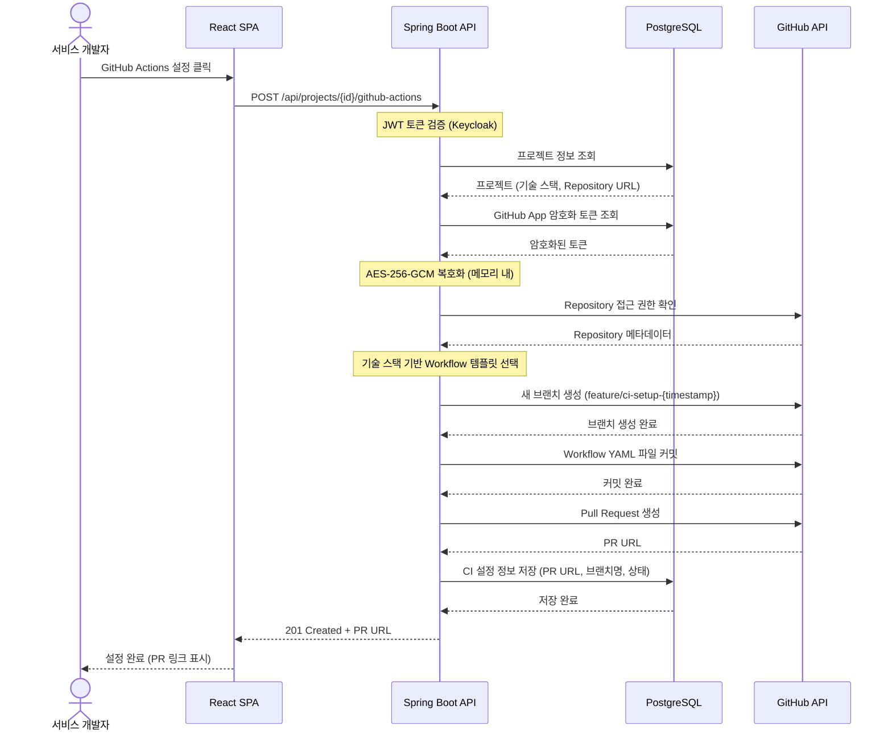

### 5.2 프로젝트 상세 조회 (CI 상태 포함)

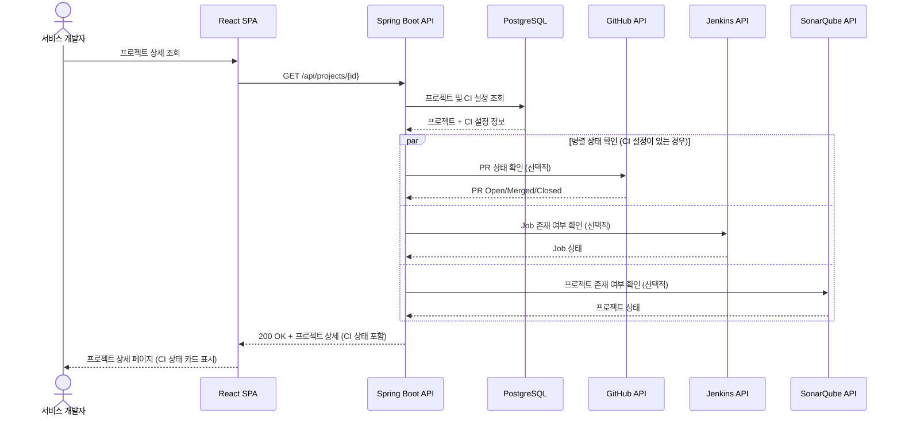

---

## 6. 확장 전략

### 6.1 MVP 단계 아키텍처

MVP에서는 단일 Docker Compose 환경으로 운영합니다.

- **동시 사용자 50명** 수용 (MVP 목표)
- **단일 Spring Boot 인스턴스** (Scale-out 불필요)
- **PostgreSQL 단일 인스턴스** (연결 풀: 최소 5, 최대 20)

### 6.2 향후 확장 방향

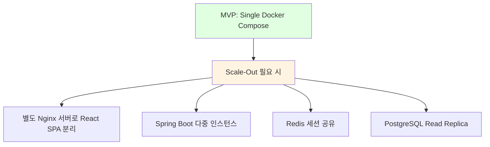

- **수평 확장**: Spring Boot를 무상태(Stateless)로 설계하여 향후 다중 인스턴스 가능
- **캐싱**: 외부 API (GitHub, Jenkins, SonarQube) Rate Limit 대응을 위한 캐싱 검토
- **메시지 큐**: CI 설정 생성이 오래 걸리는 경우 비동기 Job Queue 도입 검토

### 6.3 외부 API Rate Limit 대응

| 도구 | Rate Limit | 대응 전략 |
|------|-----------|-----------|
| GitHub App | 15,000 req/시간 | API 응답 캐싱, 불필요한 중복 호출 방지 |
| Jenkins | 서버 정책에 따름 | Timeout 설정 (10초), Circuit Breaker 패턴 검토 |
| SonarQube | 서버 정책에 따름 | Timeout 설정 (15초), 에러 시 명확한 안내 |

---

## 7. 보안 아키텍처

### 7.1 인증 흐름 (Keycloak OIDC)

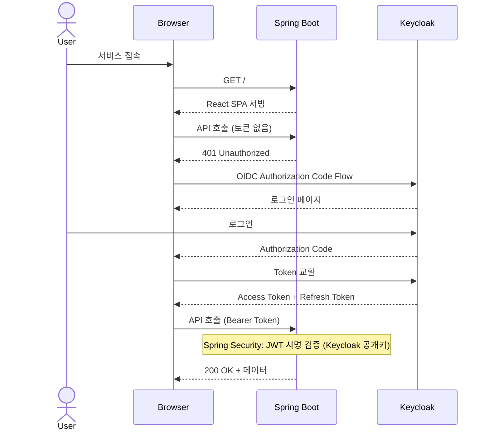

### 7.2 토큰 암호화 아키텍처 (AES-256-GCM)

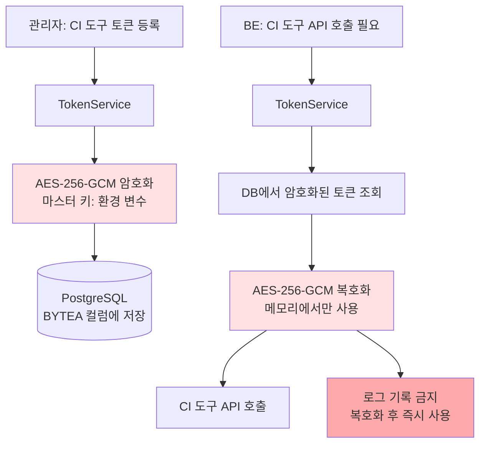

### 7.3 보안 계층

| 계층 | 보안 조치 |
|------|-----------|
| **전송** | HTTPS (프로덕션 필수), TLS 1.2+ |
| **인증** | Keycloak OIDC, JWT 토큰 검증 (Spring Security) |
| **인가** | RBAC - 서비스 개발자 / 관리자 역할 분리 |
| **데이터** | AES-256-GCM 암호화 (CI 도구 토큰) |
| **입력 검증** | Bean Validation, SQL Injection 방지 (JPA Parameterized Query) |
| **CSRF** | Spring Security CSRF, SameSite 쿠키 |
| **로깅** | 복호화된 토큰 로그 기록 금지, 토큰은 마스킹 처리 |

---

## 8. 운영 및 모니터링

### 8.1 헬스 체크

```
GET /actuator/health
→ { "status": "UP", "components": { "db": { "status": "UP" }, "keycloak": { ... } } }
```

- **응답 시간 목표**: < 200ms
- **Docker Compose**: `healthcheck` 설정으로 자동 재시작
- **의존성 상태**: PostgreSQL 연결 상태 포함

### 8.2 로그 관리

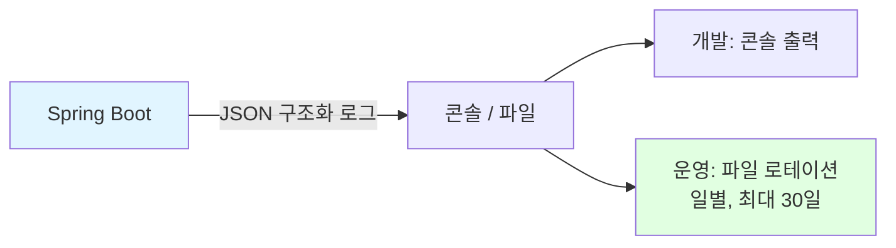

**로그 이벤트**:
- 인증 이벤트 (로그인 성공/실패)
- 프로젝트 생성/삭제
- CI 도구 설정 생성/조회 (성공/실패)
- 토큰 등록/삭제 (토큰 값 제외)
- 외부 API 호출 (요청 시간, 상태 코드, 토큰 마스킹)

---

## ✅ 완료 체크리스트

- [x] 전체 시스템 아키텍처 다이어그램 작성 완료
- [x] C4 Level 1/2 컨텍스트/컨테이너 다이어그램 작성 완료
- [x] 레이어 아키텍처 정의 완료
- [x] 기술 스택 선정 및 문서화 완료 (Kotlin/Spring Boot/React/PostgreSQL/Keycloak)
- [x] Docker Compose 배포 아키텍처 설계 완료
- [x] React SPA Static Serving 방식 정의 완료
- [x] 데이터 흐름 정의 완료 (GitHub Actions 생성, 상태 조회)
- [x] 확장 전략 수립 완료
- [x] 보안 아키텍처 설계 완료 (OIDC, AES-256-GCM)
- [x] 운영/모니터링 전략 정의 완료

---

**다음 단계**: [주요 컴포넌트](components/) 설계
