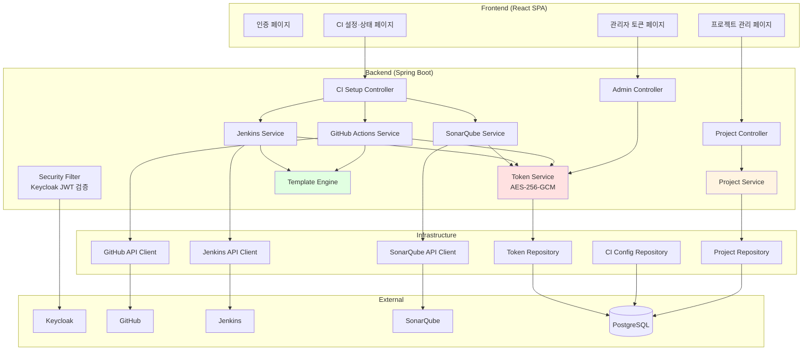
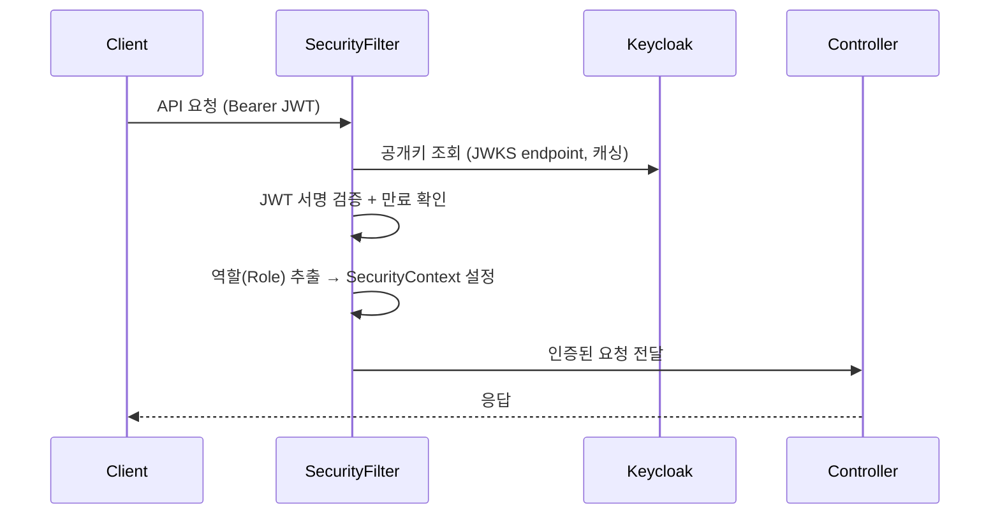
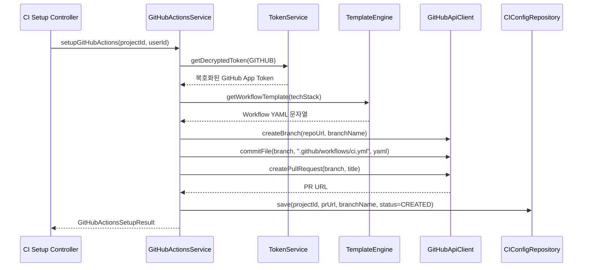
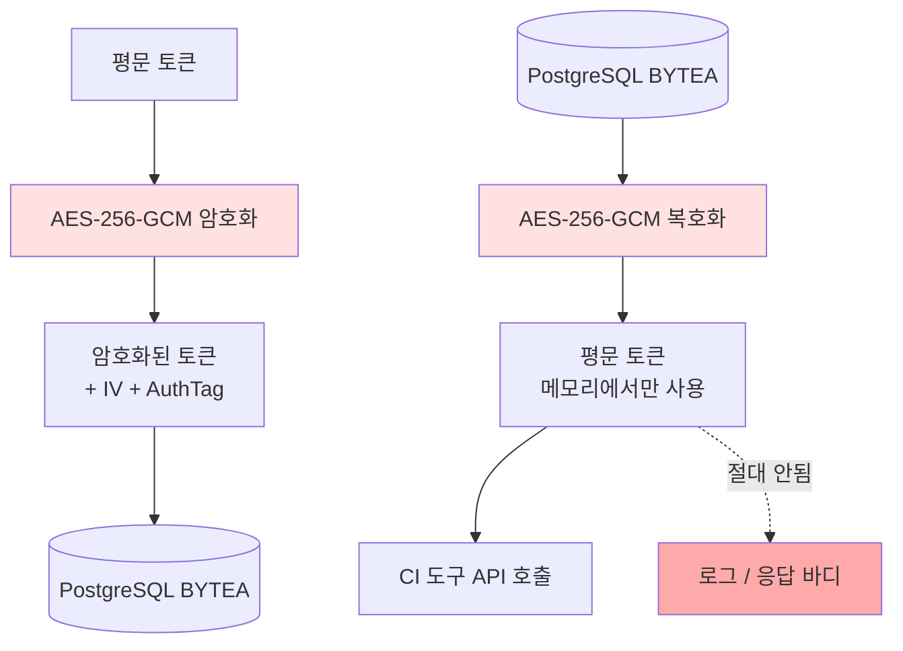
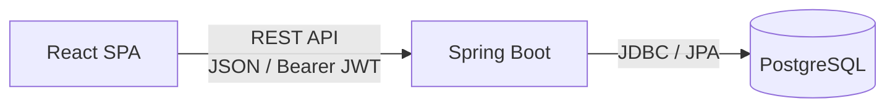
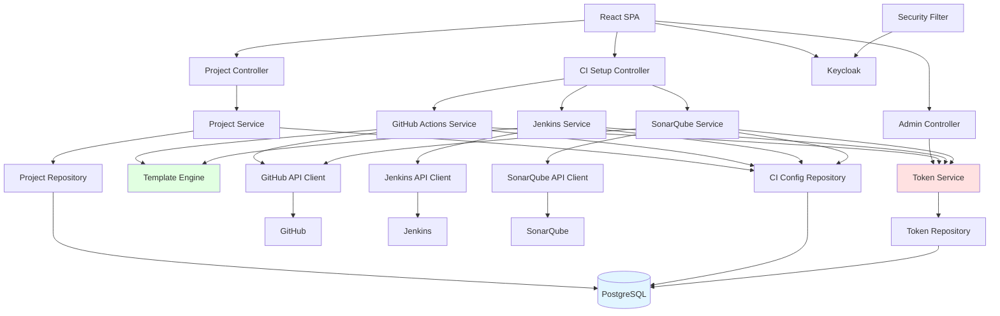

# 주요 컴포넌트 (Components)
{: .no_toc }

CI Hub 시스템을 구성하는 주요 컴포넌트와 역할을 정의합니다.
{: .fs-6 .fw-300 }

---

## 목차
{: .no_toc .text-delta }

1. TOC
{:toc}

---

## 1. 컴포넌트 개요



---

## 2. Frontend 컴포넌트 (React SPA)

### 2.1 페이지 구조

```
/                   → 홈 (로그인 여부에 따라 리다이렉트)
/login              → 로그인 (Keycloak 리다이렉트)
/projects           → 프로젝트 목록 [인증 필요]
/projects/new       → 프로젝트 생성 [인증 필요]
/projects/:id       → 프로젝트 상세 + CI 상태 [인증 필요]
/admin/tokens       → CI 도구 토큰 관리 [관리자 전용]
```

### 2.2 주요 컴포넌트 구성

**인증 관련**

| 컴포넌트 | 역할 |
|----------|------|
| `ProtectedRoute` | 인증 여부 확인, 미인증 시 로그인 페이지로 리다이렉트 |
| `AdminRoute` | 관리자 역할 확인, 일반 사용자 접근 차단 |
| `AuthProvider` | Keycloak 세션 상태 관리, 토큰 자동 갱신 |
| `LoginPage` | Keycloak OIDC 로그인 플로우 시작 |

**프로젝트 관련**

| 컴포넌트 | 역할 |
|----------|------|
| `ProjectListPage` | 프로젝트 목록, CI 상태 배지, 프로젝트 생성 버튼 |
| `ProjectCreatePage` | 단계별 프로젝트 생성 폼 (프로젝트명 → Repository URL → 기술 스택) |
| `ProjectDetailPage` | 프로젝트 정보 + CI 도구별 상태 카드 |
| `CIStatusCard` | 각 CI 도구 상태 표시 (URL 링크, 설정 버튼, 상태 배지) |
| `TechStackSelector` | 기술 스택 선택 UI (Java/Spring Boot, TypeScript/React, Node.js, JavaScript/Angular) |

**관리자 관련**

| 컴포넌트 | 역할 |
|----------|------|
| `AdminTokenPage` | CI 도구별 공통 토큰 등록·삭제 화면 |
| `TokenForm` | 토큰 입력 폼 (Jenkins URL/사용자명/토큰, GitHub App ID, SonarQube URL/토큰) |

### 2.3 상태 관리

| 상태 | 관리 방법 | 저장 위치 |
|------|-----------|-----------|
| **인증 상태** | Keycloak JS Adapter 또는 Context | 메모리 + sessionStorage |
| **프로젝트 목록** | React Query (서버 상태) | 캐시 (5분) |
| **프로젝트 상세** | React Query (서버 상태) | 캐시 (1분) |
| **폼 상태** | React useState / React Hook Form | 컴포넌트 로컬 |

---

## 3. Backend 컴포넌트 (Spring Boot)

### 3.1 Security Filter (Keycloak OIDC)

**책임**: 모든 API 요청에서 JWT 토큰을 검증하고 사용자 정보를 SecurityContext에 저장



**주요 설정**:
- `/api/**`: 인증 필수
- `/api/admin/**`: `ROLE_ADMIN` 필요
- `/actuator/health`: 공개
- `/**`: React SPA (공개, Spring Security 필터 제외)

### 3.2 Project Controller

**책임**: 프로젝트 CRUD REST API 제공

**API 엔드포인트**:

| HTTP 메서드 | 경로 | 역할 |
|-------------|------|------|
| `GET` | `/api/projects` | 사용자의 프로젝트 목록 조회 |
| `POST` | `/api/projects` | 새 프로젝트 생성 |
| `GET` | `/api/projects/{id}` | 프로젝트 상세 조회 (CI 상태 포함) |
| `DELETE` | `/api/projects/{id}` | 프로젝트 삭제 |

**의존성**: `ProjectService`

### 3.3 CI Setup Controller

**책임**: CI 도구별 설정 REST API 제공 (Phase별 활성화)

**API 엔드포인트**:

| HTTP 메서드 | 경로 | Phase | 역할 |
|-------------|------|-------|------|
| `POST` | `/api/projects/{id}/jenkins` | Phase 1 | Jenkins Job 생성 |
| `GET` | `/api/projects/{id}/jenkins` | Phase 1 | Jenkins 상태 조회 |
| `POST` | `/api/projects/{id}/github-actions` | Phase 2 | GitHub Actions Workflow 생성 |
| `GET` | `/api/projects/{id}/github-actions` | Phase 2 | GitHub Actions 상태 조회 |
| `POST` | `/api/projects/{id}/sonarqube` | Phase 3 | SonarQube 프로젝트 생성 |
| `GET` | `/api/projects/{id}/sonarqube` | Phase 3 | SonarQube 상태 조회 |

**의존성**: `JenkinsService`, `GitHubActionsService`, `SonarQubeService`

### 3.4 Admin Controller

**책임**: CI 도구 공통 토큰 관리 API (관리자 전용)

**API 엔드포인트**:

| HTTP 메서드 | 경로 | 역할 |
|-------------|------|------|
| `GET` | `/api/admin/tokens` | 등록된 토큰 목록 (값 미포함) |
| `PUT` | `/api/admin/tokens/jenkins` | Jenkins 공통 토큰 등록/갱신 |
| `PUT` | `/api/admin/tokens/github` | GitHub App 공통 토큰 등록/갱신 |
| `PUT` | `/api/admin/tokens/sonarqube` | SonarQube 공통 토큰 등록/갱신 |
| `DELETE` | `/api/admin/tokens/{type}` | 공통 토큰 삭제 |

**의존성**: `TokenService`

### 3.5 Project Service

**책임**: 프로젝트 관련 비즈니스 로직 처리

**주요 로직**:
1. 프로젝트 생성: 이름 중복 검사 → DB 저장 → 기술 스택 검증
2. 프로젝트 목록: 현재 사용자 소유 프로젝트만 조회 (userId 필터)
3. 프로젝트 상세: 프로젝트 + 각 CI 설정 정보 + 외부 상태 조회 (선택적)
4. 프로젝트 삭제: 소유권 확인 → CI 설정 데이터 삭제 → 프로젝트 삭제

**의존성**: `ProjectRepository`, `CIConfigRepository`

### 3.6 GitHub Actions Service (Phase 2)

**책임**: GitHub Actions Workflow 생성 비즈니스 로직



**의존성**: `TokenService`, `TemplateEngine`, `GitHubApiClient`, `CIConfigRepository`

### 3.7 Jenkins Service (Phase 1)

**책임**: Jenkins Job 생성 비즈니스 로직

**주요 로직**:
1. 공통 Jenkins 토큰 복호화
2. 기술 스택에 맞는 Jenkins Job XML 템플릿 선택
3. Jenkins API를 통해 Job 생성
4. GitHub Webhook URL 설정
5. Job URL 및 상태 DB 저장

**중복 처리**: 동일 Job 이름 존재 시 숫자 suffix 추가 (`project-name-2`)

**의존성**: `TokenService`, `TemplateEngine`, `JenkinsApiClient`, `CIConfigRepository`

### 3.8 SonarQube Service (Phase 3)

**책임**: SonarQube 프로젝트 생성 및 GitHub 연동 설정

**주요 로직**:
1. 공통 SonarQube 토큰 복호화
2. SonarQube 프로젝트 생성 (키: GitHub Repository 이름 기반)
3. 프로젝트 분석 토큰 생성
4. Community Branch Plugin 설정
5. GitHub PR Decorator 설정 (GitHub App 토큰 사용)
6. SonarQube 분석 단계를 기존 GitHub Actions Workflow에 추가
7. GitHub Secrets에 SonarQube 토큰 등록
8. 프로젝트 URL 및 토큰 DB 저장 (암호화)

**의존성**: `TokenService`, `SonarQubeApiClient`, `GitHubApiClient`, `CIConfigRepository`

### 3.9 Token Service

**책임**: CI 도구 공통 토큰의 AES-256-GCM 암호화·복호화



**암호화 방식**:
- 알고리즘: AES-256-GCM (Galois/Counter Mode)
- 마스터 키: 환경 변수 `ENCRYPTION_KEY` (256-bit)
- IV: 암호화마다 랜덤 생성 (96-bit)
- 저장 형식: `[IV (12 bytes)] + [암호화된 데이터] + [Auth Tag (16 bytes)]`

**의존성**: `TokenRepository`

### 3.10 Template Engine

**책임**: 기술 스택별 CI 도구 템플릿 파일 관리 및 렌더링

**지원 템플릿**:

| 기술 스택 | GitHub Actions Workflow | Jenkins Job XML |
|-----------|-------------------------|-----------------|
| Java/Spring Boot | Gradle/Maven 빌드, JUnit 테스트, JAR 생성 | JDK 설정, Gradle/Maven 빌드, 테스트, 아티팩트 보관 |
| TypeScript/React | Node.js 설정, npm install, 빌드, Jest 테스트 | Node.js 설정, npm install, 빌드, 테스트 |
| Node.js | Node.js 설정, npm install, 테스트, ESLint | Node.js 설정, npm install, 테스트 |
| JavaScript/Angular | Node.js 설정, npm install, Angular 빌드, 테스트 | Node.js 설정, npm install, Angular 빌드, 테스트 |

**템플릿 저장 위치**: `src/main/resources/templates/`
- `github-actions/java-spring-boot.yml`
- `github-actions/typescript-react.yml`
- `github-actions/nodejs.yml`
- `github-actions/javascript-angular.yml`
- `jenkins/java-spring-boot.xml`
- `jenkins/typescript-react.xml`
- `jenkins/nodejs.xml`
- `jenkins/javascript-angular.xml`

---

## 4. Infrastructure 컴포넌트

### 4.1 GitHub API Client

**책임**: GitHub REST API v3 호출 래핑

**주요 메서드**:

| 메서드 | GitHub API | 용도 |
|--------|------------|------|
| `getRepository(owner, repo)` | `GET /repos/{owner}/{repo}` | Repository 정보 및 권한 확인 |
| `createBranch(owner, repo, branch, sha)` | `POST /repos/{owner}/{repo}/git/refs` | CI 설정 브랜치 생성 |
| `createOrUpdateFile(owner, repo, path, content, branch)` | `PUT /repos/{owner}/{repo}/contents/{path}` | Workflow YAML 파일 커밋 |
| `createPullRequest(owner, repo, title, head, base)` | `POST /repos/{owner}/{repo}/pulls` | PR 생성 |
| `getPullRequest(owner, repo, prNumber)` | `GET /repos/{owner}/{repo}/pulls/{number}` | PR 상태 조회 |
| `createOrUpdateSecret(owner, repo, secretName, value)` | `PUT /repos/{owner}/{repo}/actions/secrets/{secret_name}` | GitHub Secrets 등록 |

**에러 처리**:
- `404`: Repository 없음 또는 GitHub App 미설치 → 안내 메시지
- `403`: 권한 없음 → 권한 요청 안내
- `422`: 중복 브랜치 → 새 브랜치명 생성
- 타임아웃: 20초

### 4.2 Jenkins API Client

**책임**: Jenkins REST API 호출 래핑 (Basic Auth)

**주요 메서드**:

| 메서드 | Jenkins API | 용도 |
|--------|-------------|------|
| `createJob(jobName, configXml)` | `POST /createItem?name={name}` | Job 생성 |
| `getJob(jobName)` | `GET /job/{name}/api/json` | Job 존재 여부 확인 |
| `getLastBuildStatus(jobName)` | `GET /job/{name}/lastBuild/api/json` | 최근 빌드 상태 |
| `validateConnection(jenkinsUrl, username, apiToken)` | `GET /api/json` | 연결 유효성 검증 |

**에러 처리**:
- 연결 불가: Circuit Breaker 패턴 고려, 명확한 에러 메시지
- `409`: 동일 Job 이름 존재 → suffix 추가
- 타임아웃: 10초

### 4.3 SonarQube API Client

**책임**: SonarQube Web API 호출 래핑 (Bearer Token)

**주요 메서드**:

| 메서드 | SonarQube API | 용도 |
|--------|---------------|------|
| `createProject(projectKey, name)` | `POST /api/projects/create` | 프로젝트 생성 |
| `generateToken(projectKey, tokenName)` | `POST /api/user_tokens/generate` | 분석 토큰 생성 |
| `getQualityGateStatus(projectKey)` | `GET /api/qualitygates/project_status` | Quality Gate 상태 |
| `setGitHubBinding(projectKey, appId, installationId)` | `POST /api/alm_settings/set_github_binding` | GitHub 연동 |
| `validateConnection(sonarUrl, token)` | `GET /api/system/status` | 연결 유효성 검증 |

**에러 처리**:
- `400`: 중복 프로젝트 키 → suffix 추가
- 연결 불가: 명확한 에러 메시지
- 타임아웃: 15초

### 4.4 JPA Repositories

**Project Repository**

```kotlin
interface ProjectRepository : JpaRepository<Project, Long> {
    fun findByUserId(userId: String): List<Project>
    fun findByIdAndUserId(id: Long, userId: String): Optional<Project>
    fun existsByNameAndUserId(name: String, userId: String): Boolean
}
```

**CI Config Repository**

```kotlin
interface CIConfigRepository : JpaRepository<CIConfig, Long> {
    fun findByProjectId(projectId: Long): Optional<CIConfig>
}
```

**Token Repository**

```kotlin
interface CITokenRepository : JpaRepository<CIToken, Long> {
    fun findByToolType(toolType: CIToolType): Optional<CIToken>
    fun findAllByOrderByToolTypeAsc(): List<CIToken>
}
```

---

## 5. 컴포넌트 간 통신

### 5.1 내부 통신



- **프로토콜**: HTTP/HTTPS, REST API, JSON
- **인증**: Bearer JWT (Keycloak Access Token)
- **에러 처리**: 표준 HTTP 상태 코드 + JSON 에러 바디

### 5.2 외부 통신

```mermaid
graph LR
    BE[Spring Boot] -->|HTTPS<br/>GitHub App JWT / Installation Token| GH[GitHub API]
    BE -->|HTTP/S<br/>Basic Auth (username:api-token)| JK[Jenkins API]
    BE -->|HTTP/S<br/>Bearer Token| SQ[SonarQube API]
    FE[React SPA] -->|HTTPS<br/>OIDC Redirect| KC[Keycloak]
    BE -->|HTTPS<br/>JWKS Endpoint| KC
```

### 5.3 표준 에러 응답 형식

```json
{
  "timestamp": "2026-02-19T10:00:00Z",
  "status": 400,
  "error": "Bad Request",
  "message": "GitHub Repository에 접근할 수 없습니다. GitHub App 설치 여부를 확인해주세요.",
  "path": "/api/projects/1/github-actions"
}
```

---

## 6. 컴포넌트 의존성 다이어그램



---

## 7. 컴포넌트 생명주기

### 7.1 Spring Boot 초기화 순서

```
1. 환경 변수 로드 (DB URL, ENCRYPTION_KEY, Keycloak URL 등)
2. PostgreSQL 연결 및 Connection Pool 초기화 (HikariCP)
3. Keycloak JWKS 공개키 사전 로드 (캐싱)
4. Spring Security 필터 체인 초기화
5. REST Controller 라우트 등록
6. React SPA Static Resource Handler 등록
7. Actuator Health Check 엔드포인트 활성화
8. 서버 시작 (포트: 8080)
```

### 7.2 Graceful Shutdown

```
1. 새 HTTP 요청 거부 (Health Check: DOWN)
2. 진행 중인 요청 완료 대기 (최대 30초)
3. DB Connection Pool 종료
4. 로그 플러시
5. JVM 종료
```

---

## 8. 컴포넌트 설정

### 8.1 주요 환경 변수

```bash
# Database
SPRING_DATASOURCE_URL=jdbc:postgresql://ci-hub-db:5432/cihub
SPRING_DATASOURCE_USERNAME=cihub
SPRING_DATASOURCE_PASSWORD=<secret>

# Keycloak
SPRING_SECURITY_OAUTH2_RESOURCESERVER_JWT_ISSUER_URI=http://keycloak:8180/realms/ci-hub

# 토큰 암호화 마스터 키 (256-bit, Base64 인코딩)
ENCRYPTION_KEY=<base64-encoded-256-bit-key>

# 로그 레벨
LOGGING_LEVEL_ROOT=INFO
LOGGING_LEVEL_COM_CIHUB=DEBUG
```

### 8.2 application.yml 주요 설정

```yaml
server:
  port: 8080

spring:
  datasource:
    hikari:
      minimum-idle: 5
      maximum-pool-size: 20
      connection-timeout: 30000
      idle-timeout: 600000

  jpa:
    hibernate:
      ddl-auto: validate   # Flyway로 스키마 관리
    open-in-view: false

  security:
    oauth2:
      resourceserver:
        jwt:
          issuer-uri: ${SPRING_SECURITY_OAUTH2_RESOURCESERVER_JWT_ISSUER_URI}

management:
  endpoints:
    web:
      exposure:
        include: health, info, metrics
  endpoint:
    health:
      show-details: always

# 외부 API Timeout 설정
cihub:
  github:
    timeout-seconds: 20
  jenkins:
    timeout-seconds: 10
  sonarqube:
    timeout-seconds: 15
```

---

## ✅ 완료 체크리스트

- [x] Frontend 컴포넌트 정의 완료 (페이지 구조, 주요 컴포넌트)
- [x] Backend 컴포넌트 정의 완료 (Controller, Service, Repository)
- [x] CI 도구별 Service 컴포넌트 정의 완료 (GitHub Actions, Jenkins, SonarQube)
- [x] Token Service (AES-256-GCM) 정의 완료
- [x] Template Engine 컴포넌트 정의 완료
- [x] Infrastructure 컴포넌트 정의 완료 (API Client, Repository)
- [x] 컴포넌트 간 통신 방식 정의 완료
- [x] 컴포넌트 의존성 매핑 완료
- [x] 컴포넌트 생명주기 정의 완료
- [x] 환경 변수 및 설정 정의 완료

---

**다음 단계**: [인터페이스 설계](interface-design/)
