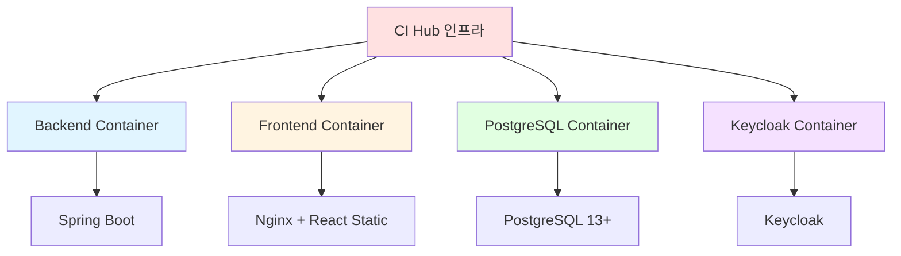
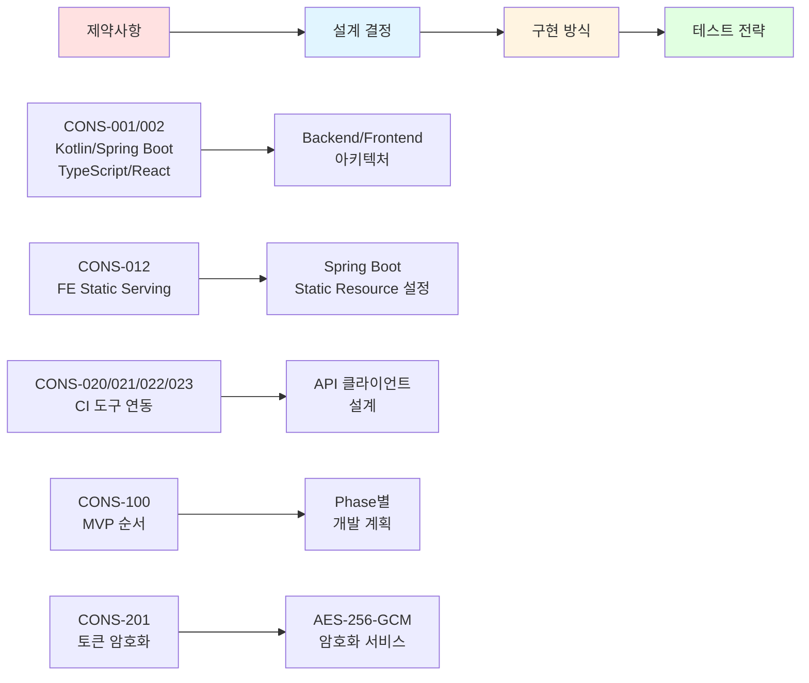

# 제약사항 (Constraints)
{: .no_toc }

프로젝트 수행 시 고려해야 할 제한사항을 정의합니다.
{: .fs-6 .fw-300 }

---

## 목차
{: .no_toc .text-delta }

1. TOC
{:toc}

---

## 개요

제약사항은 프로젝트의 설계와 구현에 영향을 미치는 제한 요소들을 명시합니다. 이러한 제약사항을 고려하지 않으면 프로젝트 실패의 원인이 될 수 있습니다.

---

## 1. 기술적 제약사항 (Technical Constraints)

### 1.1 기술 스택 제약

**CONS-001: 프로그래밍 언어 (확정)**
- **제약**:
  - Backend: Kotlin (JVM 기반)
  - Frontend: TypeScript
- **이유**: 프로젝트 요구사항에 명시된 기술 스택
- **영향**: 개발자 채용, 라이브러리 선택, 빌드 도구

**CONS-002: 프레임워크 (확정)**
- **제약**:
  - Backend: Spring Boot 3.x
  - Frontend: React 18+
- **이유**: 프로젝트 요구사항 및 팀 전문성
- **영향**: 아키텍처 패턴, 의존성 관리, 학습 곡선

**CONS-003: 데이터베이스 (확정)**
- **제약**: PostgreSQL만 지원 (다른 RDBMS 미지원)
- **이유**: 프로젝트 요구사항에 명시
- **영향**:
  - SQL 방언 (PostgreSQL 특화 기능 사용 가능)
  - BYTEA 타입 활용 (토큰 암호화 저장)
  - JSON/JSONB 타입 활용 가능

### 1.2 인프라 제약

**CONS-010: 컨테이너 환경 (확정)**
- **제약**: Docker 및 Docker Compose 필수 사용
- **이유**: 프로젝트 요구사항 및 배포 간소화
- **영향**:
  - 모든 서비스는 컨테이너로 실행
  - 로컬 개발 환경도 Docker Compose 사용
  - 이미지 빌드 및 레지스트리 관리 필요

**CONS-011: 모노레포 구조 (선호사항)**
- **제약**: Frontend와 Backend를 하나의 Repository에서 관리
- **이유**: 프로젝트 요구사항
- **영향**:
  - 빌드 스크립트 복잡도 증가
  - 버전 관리 단순화
  - CI/CD 파이프라인 통합 필요

**CONS-012: Frontend Static Serving (확정)**
- **제약**: Build된 React 앱을 Spring Boot가 static resource로 serving
- **이유**: 프로젝트 요구사항
- **영향**:
  - Nginx 불필요 (개발 환경 제외)
  - Spring Boot에 static resource 설정 필요
  - SPA 라우팅을 위한 fallback 설정 필요

### 1.3 인증 및 CI 도구 제약

**CONS-020: Keycloak 인증 (확정)**
- **제약**: Keycloak만 인증 시스템으로 사용
- **이유**: 프로젝트 요구사항
- **영향**:
  - OpenID Connect 통합 필수
  - 자체 인증 시스템 구현 불가
  - Keycloak 서버 운영 및 관리 필요

**CONS-021: GitHub App 연동 방식 (확정)**
- **제약**: GitHub App을 통한 Repository 접근만 지원
- **이유**: OAuth App 대비 보안성 및 권한 세분화
- **영향**:
  - GitHub App 생성 및 등록 필요
  - Installation Token 관리 복잡도
  - Personal Access Token 미지원

**CONS-022: Jenkins API Token (확정)**
- **제약**: Jenkins REST API + API Token 방식만 지원
- **이유**: Jenkins 표준 인증 방식
- **영향**:
  - 사용자가 Jenkins에서 직접 API Token 생성 필요
  - Basic Authentication 사용
  - Jenkins 서버 URL 및 사용자명 필요

**CONS-023: SonarQube 자체 호스팅 (확정)**
- **제약**:
  - SonarQube Community Edition (자체 호스팅)
  - Community Branch Plugin 사용
  - SonarCloud 미지원
- **이유**: 비용 절감 및 프로젝트 요구사항
- **영향**:
  - SonarQube 서버 운영 필요
  - Branch 분석을 위한 플러그인 설치 필요
  - Developer Edition 기능 미사용

---

## 2. 비즈니스 제약사항 (Business Constraints)

### 2.1 MVP 범위 제약

**CONS-100: MVP 우선순위 (확정)**
- **제약**: GitHub Actions → Jenkins → SonarQube 순서로 개발 완료
- **이유**: 프로젝트 요구사항 및 점진적 가치 제공
- **영향**:
  - Phase 1: GitHub Actions만 동작
  - Phase 2: GitHub Actions + Jenkins 동작
  - Phase 3: 모든 CI 도구 통합
  - 각 Phase별 독립적인 배포 가능

**CONS-101: 템플릿 제약 (확정)**
- **제약**: 미리 정의된 4가지 기술 스택 템플릿만 제공
  - Java/Spring Boot
  - TypeScript/React
  - Node.js (Backend)
  - JavaScript/Angular
- **이유**: MVP 범위 제한 및 복잡도 관리
- **영향**:
  - 커스텀 템플릿 생성 불가 (MVP 범위)
  - 사용자가 직접 기술 스택 선택 필요
  - 템플릿 추가는 시스템 개발자만 가능

**CONS-102: 단일 사용자 권한 (확정)**
- **제약**: MVP에서는 팀/조직 단위 권한 관리 미지원
- **이유**: 개발 복잡도 감소
- **영향**:
  - 사용자는 자신의 프로젝트만 관리
  - 프로젝트 공유 기능 없음
  - 향후 팀 기능 확장 시 데이터 마이그레이션 필요

### 2.2 기능 제약

**CONS-110: GitHub Repository 생성 미지원 (MVP)**
- **제약**: 기존 GitHub Repository에만 CI 설정 가능
- **이유**: MVP 범위 제한
- **영향**:
  - 사용자가 미리 Repository 생성 필요
  - 향후 Repository 생성 기능 추가 가능

**CONS-111: 롤백 기능 미지원 (MVP)**
- **제약**: CI 설정 롤백 기능 미제공
- **이유**: MVP 범위 제한
- **영향**:
  - 설정 실패 시 수동으로 원복 필요
  - 향후 버전 관리 및 롤백 기능 추가 검토

**CONS-112: 실시간 진행 상황 표시 (선택적)**
- **제약**: CI 설정 진행 상황 실시간 표시는 nice-to-have
- **이유**: 개발 우선순위 및 복잡도
- **영향**:
  - 사용자는 설정 완료 후 결과 확인
  - WebSocket/SSE 구현 불필요 (MVP)
  - 향후 사용자 경험 개선 시 추가

---

## 3. 법적/규제 제약사항 (Legal/Regulatory Constraints)

### 3.1 개인정보 및 보안

**CONS-200: 최소한의 개인정보 수집**
- **제약**: Keycloak을 통한 최소 정보만 수집 (사용자 ID, 이메일)
- **이유**: 개인정보보호법 준수 및 MVP 범위
- **영향**:
  - 별도 회원가입 폼 불필요
  - Keycloak에서 개인정보 처리 담당
  - 프로필 관리 기능 최소화

**CONS-201: API 토큰 보안**
- **제약**: GitHub/Jenkins/SonarQube 토큰은 암호화 저장 필수
- **이유**: 보안 모범 사례 및 데이터 유출 방지
- **영향**:
  - AES-256-GCM 암호화 구현 필수
  - 토큰은 메모리에서만 사용, 로그 기록 금지
  - 암호화 키 관리 전략 필요

### 3.2 오픈소스 라이선스

**CONS-210: 오픈소스 라이선스 정책**
- **제약**:
  - Copyleft 라이선스 (GPL, AGPL) 사용 지양
  - 허용 라이선스: Apache 2.0, MIT, BSD
- **이유**: 상업적 활용 가능성 확보
- **영향**:
  - 의존성 라이브러리 선택 시 라이선스 확인
  - Spring Boot, React 등은 Apache 2.0/MIT 라이선스
  - Keycloak (Apache 2.0), PostgreSQL (PostgreSQL License - 유사 BSD)

---

## 4. 환경적 제약사항 (Environmental Constraints)

### 4.1 외부 API 의존성

**CONS-300: GitHub API Rate Limit**
- **제약**:
  - GitHub App: 시간당 15,000 요청 (설치당)
  - 초과 시 API 호출 불가
- **이유**: GitHub API 정책
- **영향**:
  - Rate Limit 모니터링 필요
  - 과도한 API 호출 방지
  - 요청 캐싱 검토

**CONS-301: Jenkins/SonarQube 서버 가용성**
- **제약**:
  - Jenkins/SonarQube는 사용자 또는 조직이 별도 운영
  - CI Hub는 서버 가용성을 보장할 수 없음
- **이유**: 외부 시스템 의존
- **영향**:
  - API 호출 실패 시 명확한 에러 메시지
  - 재시도 로직 구현
  - Timeout 설정 (10-30초)

### 4.2 개발 환경

**CONS-310: 로컬 개발 환경**
- **제약**: Docker Desktop 필수 (Windows/macOS)
- **이유**: Docker Compose 기반 개발 환경
- **영향**:
  - 개발자는 Docker Desktop 설치 필요
  - 리소스 요구사항: 최소 8GB RAM, 20GB 디스크
  - Windows: WSL2 설정 필요

---

## 5. 조직적 제약사항 (Organizational Constraints)

### 5.1 문서화 요구사항

**CONS-400: 필수 문서 (프로젝트 요구사항)**
- **제약**:
  - 요구사항 명세서 (Functional, Non-Functional, Constraints)
  - 설계서 (HLD, DLD)
  - API 문서 (OpenAPI/Swagger)
  - 테스트 전략 및 테스트 케이스
- **이유**: 프로젝트 관리 및 유지보수
- **영향**:
  - 문서 작성 시간 확보
  - Jekyll 기반 문서 사이트 운영
  - API 문서는 SpringDoc OpenAPI 자동 생성

### 5.2 개발 도구 및 환경

**CONS-410: 버전 관리 및 협업 도구**
- **제약**:
  - 버전 관리: Git (GitHub)
  - 이슈 트래킹: GitHub Issues (또는 별도 도구)
  - CI/CD: GitHub Actions (프로젝트 자체 CI)
- **이유**: 표준 개발 도구 사용
- **영향**:
  - Git 워크플로우 정의 필요
  - 브랜치 전략 수립 (GitFlow, GitHub Flow 등)
  - Pull Request 기반 코드 리뷰

---

## 6. 가정 사항 (Assumptions)

제약사항을 정의하면서 다음 사항들을 가정합니다:

**ASM-001: 외부 API 안정성**
- GitHub API, Jenkins API, SonarQube API가 안정적으로 동작
- API 정책 변경 시 최소 3개월 사전 공지
- 하위 호환성 유지

**ASM-002: Keycloak 서버 가용성**
- Keycloak 서버가 정상적으로 운영됨
- 인증 요청 응답 시간 < 1초
- 가용성 99% 이상

**ASM-003: 사용자 행동**
- 사용자는 GitHub App을 설치하고 권한을 부여함
- 사용자는 Jenkins/SonarQube 서버를 운영하거나 접근 권한이 있음
- 사용자는 각 CI 도구의 API 토큰을 발급받을 수 있음

**ASM-004: 기술 스택 지원**
- Spring Boot 3.x, React 18+, PostgreSQL 13+가 프로젝트 기간 동안 지속 지원됨
- Kotlin 보안 패치 및 버그 수정 정기 제공
- TypeScript/ECMAScript 표준 하위 호환성 유지

**ASM-005: 사용자 규모 (MVP)**
- MVP 단계에서는 동시 사용자 50명 이하
- 프로젝트 수: 사용자당 평균 3-5개
- 총 데이터 용량: 1년 후 최대 10GB (프로젝트 메타데이터 + 토큰)

---

## 7. 제약사항 완화 전략

### 우선순위별 완화 방안

| 제약사항 ID | 제약 내용 | 영향도 | 완화 전략 |
|-------------|-----------|--------|-----------|
| CONS-101 | 템플릿 제한 (4가지) | 🔴 High | 템플릿 엔진 설계로 향후 확장 용이하게 구조화 |
| CONS-100 | MVP 순서 제약 | 🔴 High | 각 Phase별 독립 배포 가능하도록 설계 |
| CONS-300 | GitHub API Rate Limit | 🟡 Medium | Rate Limit 모니터링, 요청 캐싱, 재시도 로직 |
| CONS-301 | 외부 서버 가용성 | 🟡 Medium | Timeout 설정, 명확한 에러 메시지, Circuit Breaker 패턴 검토 |
| CONS-112 | 실시간 진행 상황 미지원 | 🟢 Low | 향후 WebSocket/SSE 도입 검토 |
| CONS-102 | 단일 사용자 권한 | 🟢 Low | 데이터 모델에서 향후 팀 기능 확장 가능하도록 설계 |

---

## 8. 제약사항 추적

### 주요 제약사항이 설계에 미치는 영향

### 제약사항-설계 매핑 테이블

| 제약사항 ID | 제약 내용 | 영향 받는 설계 | HLD 참조 | DLD 참조 |
|-------------|-----------|----------------|----------|----------|
| CONS-001 | Kotlin/TypeScript | 프로그래밍 언어 선택 | 기술 스택 | 빌드 설정 |
| CONS-002 | Spring Boot/React | 프레임워크 아키텍처 | 컴포넌트 구조 | 클래스 설계 |
| CONS-003 | PostgreSQL | 데이터베이스 설계 | 데이터 저장소 | 데이터 모델 |
| CONS-010 | Docker/Docker Compose | 배포 아키텍처 | 인프라 설계 | Dockerfile, docker-compose.yml |
| CONS-011 | 모노레포 구조 | 프로젝트 구조 | 레포지토리 설계 | 빌드 스크립트 |
| CONS-012 | FE Static Serving | 서비스 통합 방식 | Backend 아키텍처 | Spring Boot Static Resource |
| CONS-020 | Keycloak 인증 | 인증 시스템 | 보안 아키텍처 | OIDC 통합 |
| CONS-021 | GitHub App | GitHub 연동 | 외부 API 연동 | GitHub API 클라이언트 |
| CONS-022 | Jenkins API Token | Jenkins 연동 | 외부 API 연동 | Jenkins API 클라이언트 |
| CONS-023 | SonarQube 자체 호스팅 | SonarQube 연동 | 외부 API 연동 | SonarQube API 클라이언트 |
| CONS-100 | MVP Phase 순서 | 개발 우선순위 | 시스템 구성 | Phase별 기능 분리 |
| CONS-101 | 템플릿 4가지 | 템플릿 엔진 설계 | 템플릿 관리 | 템플릿 서비스 |
| CONS-201 | 토큰 암호화 | 보안 설계 | 암호화 아키텍처 | AES-256-GCM 구현 |
| CONS-300 | GitHub API Rate Limit | API 호출 최적화 | 캐싱 전략 | Rate Limit 모니터링 |

---

## ✅ 완료 체크리스트

- [ ] 모든 기술적 제약사항 식별 완료
- [ ] 비즈니스 제약사항 확인 완료
- [ ] 법적/규제 제약사항 검토 완료
- [ ] 가정 사항 문서화 완료
- [ ] 완화 전략 수립 완료
- [ ] 이해관계자 합의 완료

---

**다음 단계**: [High Level Design (HLD)](../hld/) 작성
