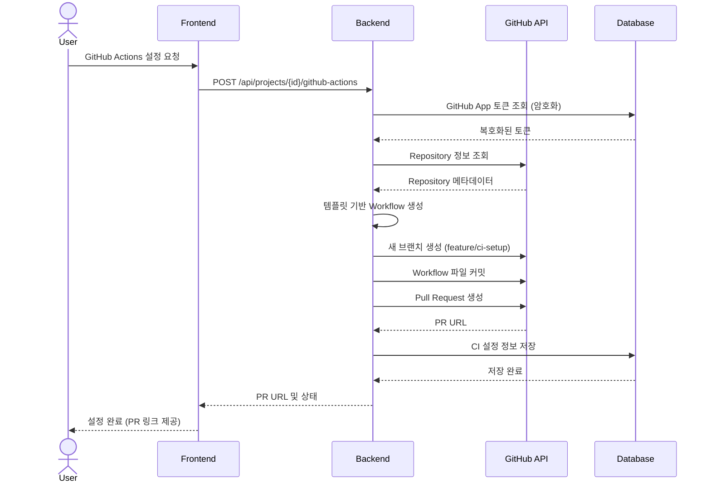

# 기능 요구사항 (Functional Requirements)
{: .no_toc }

시스템이 **무엇을** 해야 하는지 정의하는 문서입니다.
{: .fs-6 .fw-300 }

---

## 목차
{: .no_toc .text-delta }

1. TOC
{:toc}

---

## 개요

기능 요구사항은 사용자가 시스템을 통해 수행할 수 있는 기능과 시스템의 동작 방식을 구체적으로 기술합니다.

---

## 1. 사용자 스토리

### 사용자 역할 정의

| 역할 | 설명 | 권한 |
|------|------|------|
| **서비스 개발자** | CI 셋업이 필요한 프로젝트 개발자 | 프로젝트 생성, CI 설정, 조회 |
| **팀 리더** | 프로젝트를 관리하는 리더 | 프로젝트 관리, 팀원 권한 관리 (향후 확장) |
| **관리자** | 시스템 전체를 관리하는 운영자 | CI 도구 공통 토큰 등록/관리, 시스템 설정 |

### 핵심 사용자 스토리

**US-001: CI 도구 자동 셋업**
```
As a 서비스 개발자,
I want to GitHub Actions, Jenkins, SonarQube를 템플릿 기반으로 자동 셋업하고,
So that CI 도구의 복잡한 DSL을 직접 작성하지 않고도 프로젝트에 CI를 적용할 수 있다.

Acceptance Criteria:
- [ ] 기술 스택 선택을 통해 적합한 템플릿이 자동 선택됨
- [ ] GitHub Actions Workflow가 별도 브랜치에 PR로 생성됨
- [ ] Jenkins Build Configuration이 자동으로 생성됨
- [ ] SonarQube 프로젝트가 생성되고 PR Decorator가 설정됨
```

**US-002: 템플릿 기반 설정**
```
As a 서비스 개발자,
I want to 미리 정의된 기술 스택별 템플릿을 선택하여,
So that 우리 프로젝트에 적합한 빌드/테스트 단계를 쉽게 설정할 수 있다.

Acceptance Criteria:
- [ ] Java/Spring Boot, TypeScript/React, Node.js, JavaScript/Angular 템플릿 제공
- [ ] 각 템플릿은 빌드, 테스트, 정적 분석 단계를 포함
- [ ] 템플릿 선택만으로 CI 파이프라인이 구성됨
```

**US-003: CI 설정 상태 확인**
```
As a 서비스 개발자,
I want to 설정된 CI 도구들의 상태를 한눈에 확인하고,
So that GitHub Actions, Jenkins, SonarQube가 정상 동작하는지 모니터링할 수 있다.

Acceptance Criteria:
- [ ] 각 CI 도구의 설정 상태 (완료/진행중/실패) 표시
- [ ] GitHub PR 링크 제공
- [ ] Jenkins Job URL 제공
- [ ] SonarQube 프로젝트 URL 제공
```

**US-004: CI 도구 공통 토큰 관리**
```
As a 관리자,
I want to CI 도구별 공통 API 토큰을 시스템에 등록하고,
So that 서비스 개발자들이 토큰을 직접 관리하지 않고도 CI 설정을 자동화할 수 있다.

Acceptance Criteria:
- [ ] Jenkins, GitHub App, SonarQube 공통 토큰을 관리자 화면에서 등록 가능
- [ ] 등록된 토큰은 BE가 CI 도구 API 호출 시 자동으로 사용
- [ ] 서비스 개발자는 토큰을 직접 입력하거나 조회할 수 없음
- [ ] 토큰은 AES-256 암호화하여 저장
```

---

## 2. 핵심 기능 (Core Features)

### 2.1 사용자 인증 및 권한 관리

**FR-001: Keycloak 로그인**
- **설명**: 사용자는 Keycloak을 통해 로그인하여 시스템에 접근한다.
- **우선순위**: 🔴 Must have
- **입력**: Keycloak 로그인 페이지 리다이렉트
- **처리**:
  1. Keycloak 로그인 페이지로 리다이렉트
  2. Keycloak에서 인증 완료 후 콜백
  3. JWT 토큰 발급 및 세션 생성
- **출력**:
  - 성공: 액세스 토큰, 사용자 정보
  - 실패: 로그인 페이지로 리다이렉트
- **예외 처리**:
  - Keycloak 서버 응답 없음: 에러 메시지 표시

**FR-002: 사용자 세션 관리**
- **설명**: 로그인된 사용자의 세션을 유지하고 토큰을 갱신한다.
- **우선순위**: 🔴 Must have
- **입력**: 액세스 토큰, 리프레시 토큰
- **처리**:
  1. 액세스 토큰 만료 시 리프레시 토큰으로 자동 갱신
  2. 리프레시 토큰 만료 시 재로그인 요청
- **출력**: 갱신된 액세스 토큰

---

### 2.2 프로젝트 관리

**FR-010: 프로젝트 생성**
- **설명**: 사용자는 새로운 프로젝트를 생성하고 기술 스택을 선택한다.
- **우선순위**: 🔴 Must have
- **입력**:
  - 프로젝트 이름
  - GitHub Repository URL
  - 기술 스택 (Java/Spring Boot, TypeScript/React, Node.js, JavaScript/Angular)
- **처리**:
  1. 프로젝트 정보 검증
  2. GitHub Repository 접근 권한 확인
  3. 프로젝트 DB 저장
  4. 선택한 기술 스택에 맞는 템플릿 매핑
- **출력**:
  - 성공: 프로젝트 ID, 프로젝트 상세 정보
  - 실패: 에러 메시지 (중복 프로젝트명, Repository 접근 불가 등)
- **예외 처리**:
  - GitHub Repository 접근 불가: GitHub App 설치 안내
  - 중복 프로젝트명: 다른 이름 사용 요청

**FR-011: 프로젝트 목록 조회**
- **설명**: 사용자는 자신이 생성한 프로젝트 목록을 조회한다.
- **우선순위**: 🔴 Must have
- **입력**: 사용자 ID (세션에서 추출)
- **처리**: 사용자의 프로젝트 목록 조회 (페이징)
- **출력**: 프로젝트 목록 (프로젝트명, 기술스택, 생성일, CI 상태)

**FR-012: 프로젝트 상세 조회**
- **설명**: 사용자는 프로젝트의 상세 정보와 CI 설정 상태를 확인한다.
- **우선순위**: 🔴 Must have
- **입력**: 프로젝트 ID
- **처리**: 프로젝트 정보 및 CI 도구별 설정 상태 조회
- **출력**:
  - 프로젝트 기본 정보
  - GitHub Actions 상태 (PR URL 포함)
  - Jenkins 상태 (Job URL 포함)
  - SonarQube 상태 (프로젝트 URL 포함)

**FR-013: 프로젝트 삭제**
- **설명**: 사용자는 프로젝트를 삭제한다.
- **우선순위**: 🟡 Should have
- **입력**: 프로젝트 ID
- **처리**:
  1. 프로젝트 소유권 확인
  2. 연관된 CI 설정 정보 삭제 (물리적 CI 도구는 수동 삭제 안내)
  3. 프로젝트 DB 삭제
- **출력**:
  - 성공: 삭제 완료 메시지
  - 실패: 권한 없음 에러

---

### 2.3 Jenkins 설정 (MVP Phase 1)

**FR-030: Jenkins Job 생성**
- **설명**: 프로젝트의 기술 스택에 맞는 Jenkins Build Configuration을 자동 생성한다.
- **우선순위**: 🔴 Must have (MVP Phase 1)
- **입력**:
  - 프로젝트 ID
  - Jenkins 서버 URL (프로젝트별 또는 전역 설정)
- **처리**:
  1. 기술 스택에 맞는 Jenkins Job 템플릿 선택
  2. Jenkins API를 통해 Job 생성 (Groovy DSL 또는 XML Config)
  3. GitHub Repository 연동 설정
  4. 빌드 트리거 설정 (GitHub Webhook)
  5. Job URL 및 설정 상태 DB 저장
- **출력**:
  - 성공: Jenkins Job URL, Job 이름
  - 실패: 에러 메시지 (Jenkins 연동 실패, 권한 부족 등)
- **예외 처리**:
  - Jenkins API 토큰 없음: 토큰 등록 페이지 안내
  - Jenkins 서버 응답 없음: 서버 상태 확인 요청
  - 동일 Job 이름 존재: 새 Job 이름 생성 또는 기존 Job 업데이트

**FR-031: Jenkins Job 템플릿 관리**
- **설명**: 기술 스택별 Jenkins Job Configuration 템플릿을 제공한다.
- **우선순위**: 🔴 Must have
- **템플릿 구성**:
  - **Java/Spring Boot**:
    - GitHub 소스 가져오기, JDK 설정, Gradle/Maven 빌드, 테스트, 아티팩트 보관
  - **TypeScript/React**:
    - Node.js 설정, npm install, 빌드, 테스트, 정적 파일 아티팩트 보관
  - **Node.js (Backend)**:
    - Node.js 설정, npm install, 테스트, 아티팩트 보관
  - **JavaScript/Angular**:
    - Node.js 설정, npm install, Angular 빌드, 테스트

**FR-032: Jenkins 상태 조회**
- **설명**: 생성된 Jenkins Job의 상태를 조회한다.
- **우선순위**: 🔴 Must have
- **입력**: 프로젝트 ID
- **처리**:
  1. DB에서 Job URL 조회
  2. Jenkins API를 통해 Job 존재 여부 확인
  3. 최근 빌드 상태 조회 (선택적)
- **출력**:
  - Job 상태 (존재/삭제됨)
  - Job URL
  - 최근 빌드 결과 (선택적)

---

### 2.4 GitHub Actions 설정 (MVP Phase 2)



**FR-020: GitHub Actions Workflow 생성**
- **설명**: 프로젝트의 기술 스택에 맞는 GitHub Actions Workflow를 자동 생성한다.
- **우선순위**: 🔴 Must have (MVP Phase 2)
- **입력**:
  - 프로젝트 ID
  - 기술 스택 (프로젝트 생성 시 선택됨)
- **처리**:
  1. 기술 스택에 맞는 Workflow 템플릿 선택
  2. Repository에 새 브랜치 생성 (예: `feature/ci-setup-{timestamp}`)
  3. `.github/workflows/{프로젝트명}.yml` 파일 생성 및 커밋
  4. Pull Request 생성
  5. PR URL 및 설정 상태 DB 저장
- **출력**:
  - 성공: PR URL, 브랜치명, Workflow 파일 경로
  - 실패: 에러 메시지 (GitHub 연동 실패, 권한 부족 등)
- **예외 처리**:
  - GitHub App 미설치: 설치 안내 페이지 리다이렉트
  - Repository 쓰기 권한 없음: 권한 요청 안내
  - 동일 브랜치 존재: 기존 브랜치 삭제 또는 새 브랜치명 생성

**FR-021: GitHub Actions Workflow 템플릿 관리**
- **설명**: 기술 스택별 Workflow 템플릿을 제공한다.
- **우선순위**: 🔴 Must have
- **템플릿 구성**:
  - **Java/Spring Boot**:
    - JDK 설정, Gradle/Maven 빌드, 단위 테스트, JAR 생성
  - **TypeScript/React**:
    - Node.js 설정, npm install, 빌드, 테스트
  - **Node.js (Backend)**:
    - Node.js 설정, npm install, 테스트, ESLint
  - **JavaScript/Angular**:
    - Node.js 설정, npm install, Angular 빌드, 테스트

**FR-022: GitHub Actions 상태 조회**
- **설명**: 생성된 GitHub Actions의 상태를 조회한다.
- **우선순위**: 🔴 Must have
- **입력**: 프로젝트 ID
- **처리**:
  1. DB에서 PR URL 조회
  2. GitHub API를 통해 PR 상태 확인 (Open/Merged/Closed)
  3. Workflow 실행 상태 확인 (선택적)
- **출력**:
  - PR 상태 (Open/Merged/Closed)
  - PR URL
  - Workflow 파일 경로

---

### 2.5 SonarQube 설정 (MVP Phase 3)

**FR-040: SonarQube 프로젝트 생성**
- **설명**: SonarQube에 프로젝트를 생성하고 GitHub과 연동한다.
- **우선순위**: 🔴 Must have (MVP Phase 3)
- **입력**:
  - 프로젝트 ID
  - SonarQube 서버 URL (전역 설정)
- **처리**:
  1. SonarQube API를 통해 프로젝트 생성
  2. 프로젝트 분석 토큰 생성
  3. Community Branch Plugin 설정 (PR 분석)
  4. GitHub PR Decorator 설정 (GitHub App 토큰 사용)
  5. SonarQube 프로젝트 URL 및 토큰 DB 저장 (암호화)
- **출력**:
  - 성공: SonarQube 프로젝트 URL, 분석 토큰
  - 실패: 에러 메시지 (SonarQube 연동 실패, 권한 부족 등)
- **예외 처리**:
  - SonarQube API 토큰 없음: 토큰 등록 페이지 안내
  - 동일 프로젝트 키 존재: 새 프로젝트 키 생성 또는 기존 프로젝트 업데이트
  - GitHub PR Decorator 설정 실패: 수동 설정 안내

**FR-041: SonarQube GitHub Actions 통합**
- **설명**: GitHub Actions Workflow에 SonarQube 분석 단계를 추가한다.
- **우선순위**: 🔴 Must have
- **입력**: 프로젝트 ID
- **처리**:
  1. 기존 GitHub Actions Workflow 파일 조회
  2. SonarQube 분석 단계 추가 (sonar-scanner 또는 Gradle/Maven plugin)
  3. GitHub Secrets에 SonarQube 토큰 등록
  4. Workflow 파일 업데이트 (새 커밋 또는 기존 PR에 추가)
- **출력**:
  - 성공: 업데이트된 Workflow 파일, GitHub Secret 등록 완료
  - 실패: 에러 메시지

**FR-042: SonarQube 상태 조회**
- **설명**: 생성된 SonarQube 프로젝트의 상태를 조회한다.
- **우선순위**: 🔴 Must have
- **입력**: 프로젝트 ID
- **처리**:
  1. DB에서 SonarQube 프로젝트 URL 조회
  2. SonarQube API를 통해 프로젝트 존재 여부 확인
  3. 최근 분석 결과 조회 (선택적)
- **출력**:
  - 프로젝트 상태 (존재/삭제됨)
  - 프로젝트 URL
  - Quality Gate 상태 (선택적)

---

### 2.6 CI 도구 연동 토큰 관리 (관리자 전용)

> 토큰은 관리자가 시스템 전체에서 공통으로 사용할 토큰을 1회 등록한다.
> 서비스 개발자는 토큰을 직접 입력하거나 조회할 수 없으며, BE가 CI 도구 API 호출 시 자동으로 사용한다.

**FR-050: Jenkins API 공통 토큰 등록**
- **설명**: 관리자가 Jenkins API 접근을 위한 공통 토큰을 등록한다.
- **우선순위**: 🔴 Must have
- **액터**: 관리자
- **입력**:
  - Jenkins 서버 URL
  - Jenkins 사용자명
  - Jenkins API 토큰
- **처리**:
  1. 토큰 유효성 검증 (Jenkins API 호출)
  2. AES-256 암호화
  3. 시스템 공통 토큰으로 DB 저장
- **출력**: 토큰 등록 완료

**FR-051: GitHub App 공통 토큰 등록**
- **설명**: 관리자가 GitHub App Installation 토큰을 시스템에 등록한다.
- **우선순위**: 🔴 Must have
- **액터**: 관리자
- **입력**: GitHub App Installation ID
- **처리**:
  1. GitHub App에서 Installation Token 발급
  2. AES-256 암호화
  3. 시스템 공통 토큰으로 DB 저장
- **출력**: 토큰 등록 완료

**FR-052: SonarQube API 공통 토큰 등록**
- **설명**: 관리자가 SonarQube API 접근을 위한 공통 토큰을 등록한다.
- **우선순위**: 🔴 Must have
- **액터**: 관리자
- **입력**:
  - SonarQube 서버 URL
  - SonarQube API 토큰
- **처리**:
  1. 토큰 유효성 검증 (SonarQube API 호출)
  2. AES-256 암호화
  3. 시스템 공통 토큰으로 DB 저장
- **출력**: 토큰 등록 완료

**FR-053: 공통 토큰 조회 및 복호화 (내부)**
- **설명**: BE가 CI 도구 API 호출 시 공통 토큰을 복호화하여 사용한다. (사용자에게 노출되지 않음)
- **우선순위**: 🔴 Must have
- **액터**: 시스템 (BE 내부)
- **입력**: CI 도구 유형
- **처리**:
  1. DB에서 해당 CI 도구의 공통 암호화 토큰 조회
  2. AES-256 복호화
  3. 메모리에서만 사용 (로깅 금지)
- **출력**: 복호화된 토큰 (내부 사용 전용)

**FR-054: 공통 토큰 갱신/삭제**
- **설명**: 관리자가 등록된 공통 토큰을 갱신하거나 삭제한다.
- **우선순위**: 🟡 Should have
- **액터**: 관리자
- **입력**: CI 도구 유형, 새 토큰 정보 (갱신 시)
- **처리**: DB에서 토큰 갱신 또는 삭제
- **출력**: 처리 완료

---

## 3. Use Case 다이어그램

```mermaid
graph TD
    Developer[서비스 개발자]
    Admin[관리자]

    Developer --> UC01[로그인/로그아웃]
    Developer --> UC02[프로젝트 생성]
    Developer --> UC03[프로젝트 조회]
    Developer --> UC04[프로젝트 삭제]

    Developer --> UC10[Jenkins 설정]
    Developer --> UC11[GitHub Actions 설정]
    Developer --> UC12[SonarQube 설정]
    Developer --> UC21[CI 상태 확인]

    Admin --> UC01
    Admin --> UC20[CI 공통 토큰 관리]

    UC20 --> UC20A[Jenkins 토큰 등록]
    UC20 --> UC20B[GitHub App 토큰 등록]
    UC20 --> UC20C[SonarQube 토큰 등록]
    UC20 --> UC20D[토큰 갱신/삭제]

    UC10 --> UC10A[Job 생성]
    UC10 --> UC10B[빌드 트리거 설정]
    UC10 --> UC10C[상태 조회]

    UC11 --> UC11A[Workflow 생성]
    UC11 --> UC11B[PR 생성]
    UC11 --> UC11C[상태 조회]

    UC12 --> UC12A[프로젝트 생성]
    UC12 --> UC12B[PR Decorator 설정]
    UC12 --> UC12C[상태 조회]

    style Developer fill:#e1f5ff
    style Admin fill:#f0e1ff
    style UC10 fill:#ffe1e1
    style UC11 fill:#fff4e1
    style UC12 fill:#e1ffe1
    style UC20 fill:#f0e1ff
```



---

## 4. 비즈니스 규칙

**BR-001: 프로젝트 접근 권한**
- 시스템에 접근 가능한 모든 사용자는 프로젝트를 수정/삭제할 수 있다.
- 프로젝트 삭제 시 연관된 CI 설정 정보도 함께 삭제된다.
- 물리적 CI 도구 (GitHub Actions, Jenkins Job, SonarQube 프로젝트)는 자동 삭제되지 않는다.

**BR-002: CI 도구 설정 순서**
- MVP 우선순위에 따라 Jenkins → GitHub Actions → SonarQube 순으로 설정을 권장한다.
- SonarQube는 GitHub Actions가 먼저 설정되어야 통합 가능하다.
- 각 CI 도구는 독립적으로 설정 가능하지만, 통합 시 순서 의존성이 있을 수 있다.

**BR-003: 토큰 보안**
- CI 도구 API 토큰은 관리자가 시스템 공통 토큰으로 1회 등록하며, 서비스 개발자에게는 노출되지 않는다.
- 모든 공통 토큰은 AES-256으로 암호화하여 저장한다.
- 토큰은 BE 내부에서만 복호화하여 API 호출에 사용하고, 로그에 기록하지 않는다.
- 공통 토큰 삭제 시 해당 CI 도구의 모든 신규 설정이 불가능해지며, 관리자에게 경고를 표시한다.

**BR-004: GitHub Repository 접근**
- GitHub App이 설치되지 않은 Repository는 프로젝트 생성이 불가능하다.
- Repository 쓰기 권한이 없으면 GitHub Actions Workflow 생성이 불가능하다.

**BR-005: 템플릿 선택**
- 프로젝트 생성 시 선택한 기술 스택은 이후 변경 불가능하다. (MVP 범위)
- 기술 스택별로 1개의 템플릿만 제공된다. (MVP 범위)
- 향후 커스텀 템플릿 기능 추가 예정

**BR-006: PR 관리**
- GitHub Actions Workflow는 별도 브랜치 (feature/ci-setup-*)에 PR로 생성된다.
- PR은 사용자가 직접 리뷰하고 머지해야 한다.
- PR이 머지되기 전까지 Workflow는 활성화되지 않는다.

**BR-007: Jenkins Job 관리**
- Jenkins Job은 자동으로 생성되고 즉시 활성화된다.
- 중복된 Job 이름이 있을 경우 숫자 suffix를 추가한다. (예: project-name-2)

**BR-008: SonarQube 프로젝트 키**
- SonarQube 프로젝트 키는 GitHub Repository 이름을 기반으로 자동 생성된다.
- 중복된 키가 있을 경우 suffix를 추가한다.

---

## 5. 인터페이스 요구사항

### 5.1 외부 시스템 연동

**FR-100: GitHub API 연동**
- **설명**: GitHub App을 통해 Repository 정보 조회, 브랜치 생성, 파일 커밋, PR 생성 등을 수행한다.
- **우선순위**: 🔴 Must have
- **프로토콜**: REST API (HTTPS)
- **인증**: GitHub App Installation Token (JWT)
- **주요 엔드포인트**:
  - `GET /repos/{owner}/{repo}` - Repository 정보 조회
  - `POST /repos/{owner}/{repo}/git/refs` - 브랜치 생성
  - `PUT /repos/{owner}/{repo}/contents/{path}` - 파일 생성/수정
  - `POST /repos/{owner}/{repo}/pulls` - Pull Request 생성
  - `GET /repos/{owner}/{repo}/pulls/{number}` - PR 상태 조회

**FR-101: Jenkins API 연동**
- **설명**: Jenkins REST API를 통해 Job 생성, 빌드 실행, 상태 조회를 수행한다.
- **우선순위**: 🔴 Must have
- **프로토콜**: REST API (HTTP/HTTPS)
- **인증**: API Token (Basic Auth)
- **주요 엔드포인트**:
  - `POST /createItem?name={job-name}` - Job 생성
  - `GET /job/{job-name}/config.xml` - Job 설정 조회
  - `POST /job/{job-name}/build` - 빌드 실행
  - `GET /job/{job-name}/lastBuild/api/json` - 최근 빌드 상태

**FR-102: SonarQube API 연동**
- **설명**: SonarQube REST API를 통해 프로젝트 생성, 토큰 발급, Quality Gate 조회를 수행한다.
- **우선순위**: 🔴 Must have
- **프로토콜**: REST API (HTTP/HTTPS)
- **인증**: API Token (Bearer)
- **주요 엔드포인트**:
  - `POST /api/projects/create` - 프로젝트 생성
  - `POST /api/user_tokens/generate` - 분석 토큰 생성
  - `GET /api/qualitygates/project_status` - Quality Gate 상태
  - `POST /api/alm_settings/set_github_binding` - GitHub 연동 설정

**FR-103: Keycloak 연동**
- **설명**: Keycloak OpenID Connect를 통해 사용자 인증을 수행한다.
- **우선순위**: 🔴 Must have
- **프로토콜**: OpenID Connect (HTTPS)
- **인증**: OAuth 2.0 / OIDC
- **주요 엔드포인트**:
  - `/auth/realms/{realm}/protocol/openid-connect/auth` - 인증 요청
  - `/auth/realms/{realm}/protocol/openid-connect/token` - 토큰 발급
  - `/auth/realms/{realm}/protocol/openid-connect/userinfo` - 사용자 정보

---

## 6. 데이터 요구사항

### 6.1 프로젝트 데이터

| 필드 | 타입 | 필수 | 길이 | 규칙 |
|------|------|------|------|------|
| 프로젝트명 | String | ✅ | 3-100 | 영문, 숫자, 하이픈, 언더스코어만 허용 |
| GitHub Repository URL | String | ✅ | 최대 500 | GitHub URL 형식 (https://github.com/{owner}/{repo}) |
| 기술 스택 | Enum | ✅ | - | Java/Spring Boot, TypeScript/React, Node.js, JavaScript/Angular |
| 생성일 | DateTime | ✅ | - | ISO 8601 형식 |

### 6.2 CI 설정 데이터

| 필드 | 타입 | 필수 | 길이 | 규칙 |
|------|------|------|------|------|
| GitHub PR URL | String | ❌ | 최대 500 | GitHub Pull Request URL |
| GitHub 브랜치명 | String | ❌ | 최대 255 | 브랜치 네이밍 규칙 준수 |
| Jenkins Job URL | String | ❌ | 최대 500 | Jenkins Job URL |
| Jenkins Job 이름 | String | ❌ | 최대 255 | Jenkins Job 네이밍 규칙 |
| SonarQube 프로젝트 URL | String | ❌ | 최대 500 | SonarQube 프로젝트 URL |
| SonarQube 프로젝트 키 | String | ❌ | 최대 400 | SonarQube 키 규칙 준수 |

### 6.3 토큰 데이터

| 필드 | 타입 | 필수 | 길이 | 규칙 |
|------|------|------|------|------|
| CI 도구 유형 | Enum | ✅ | - | GITHUB, JENKINS, SONARQUBE |
| 암호화된 토큰 | Binary | ✅ | - | AES-256 암호화 |
| 서버 URL | String | ✅ | 최대 500 | HTTP/HTTPS URL |
| 사용자명 | String | ❌ | 최대 255 | Jenkins에만 필요 |
| 등록일 | DateTime | ✅ | - | ISO 8601 형식 |
| 마지막 사용일 | DateTime | ❌ | - | ISO 8601 형식 |

---

## 7. 요구사항 추적

| ID | 요구사항 | 우선순위 | MVP Phase | HLD 참조 | DLD 참조 | 테스트 케이스 |
|----|----------|----------|-----------|----------|----------|---------------|
| FR-001 | Keycloak 로그인 | 🔴 | All | 인증 시스템 | 인증 API | TC-001 |
| FR-002 | 사용자 세션 관리 | 🔴 | All | 인증 시스템 | 세션 관리 | TC-002 |
| FR-010 | 프로젝트 생성 | 🔴 | All | 프로젝트 관리 | 프로젝트 API | TC-010 |
| FR-011 | 프로젝트 목록 조회 | 🔴 | All | 프로젝트 관리 | 프로젝트 API | TC-011 |
| FR-012 | 프로젝트 상세 조회 | 🔴 | All | 프로젝트 관리 | 프로젝트 API | TC-012 |
| FR-013 | 프로젝트 삭제 | 🟡 | Future | 프로젝트 관리 | 프로젝트 API | TC-013 |
| FR-020 | GitHub Actions Workflow 생성 | 🔴 | Phase 2 | GitHub 연동 | GitHub API 클라이언트 | TC-020 |
| FR-021 | GitHub Actions 템플릿 관리 | 🔴 | Phase 2 | 템플릿 엔진 | 템플릿 서비스 | TC-021 |
| FR-022 | GitHub Actions 상태 조회 | 🔴 | Phase 2 | GitHub 연동 | GitHub API 클라이언트 | TC-022 |
| FR-030 | Jenkins Job 생성 | 🔴 | Phase 1 | Jenkins 연동 | Jenkins API 클라이언트 | TC-030 |
| FR-031 | Jenkins 템플릿 관리 | 🔴 | Phase 1 | 템플릿 엔진 | 템플릿 서비스 | TC-031 |
| FR-032 | Jenkins 상태 조회 | 🔴 | Phase 1 | Jenkins 연동 | Jenkins API 클라이언트 | TC-032 |
| FR-040 | SonarQube 프로젝트 생성 | 🔴 | Phase 3 | SonarQube 연동 | SonarQube API 클라이언트 | TC-040 |
| FR-041 | SonarQube GitHub Actions 통합 | 🔴 | Phase 3 | SonarQube 연동 | SonarQube API 클라이언트 | TC-041 |
| FR-042 | SonarQube 상태 조회 | 🔴 | Phase 3 | SonarQube 연동 | SonarQube API 클라이언트 | TC-042 |
| FR-050 | Jenkins API 공통 토큰 등록 (관리자) | 🔴 | Phase 1 | 토큰 관리 | 암호화 서비스 | TC-050 |
| FR-051 | GitHub App 공통 토큰 등록 (관리자) | 🔴 | Phase 2 | 토큰 관리 | 암호화 서비스 | TC-051 |
| FR-052 | SonarQube API 공통 토큰 등록 (관리자) | 🔴 | Phase 3 | 토큰 관리 | 암호화 서비스 | TC-052 |
| FR-053 | 공통 토큰 조회 및 복호화 (BE 내부) | 🔴 | All | 토큰 관리 | 암호화 서비스 | TC-053 |
| FR-054 | 공통 토큰 갱신/삭제 (관리자) | 🟡 | Future | 토큰 관리 | 토큰 API | TC-054 |

---

## ✅ 완료 체크리스트

- [ ] 모든 사용자 역할 정의 완료
- [ ] 핵심 기능 명세 작성 완료
- [ ] Use Case 다이어그램 작성 완료
- [ ] 비즈니스 규칙 정의 완료
- [ ] 데이터 입력 규칙 정의 완료
- [ ] 이해관계자 리뷰 완료

---

**다음 단계**: [비기능 요구사항](non-functional/) 작성
