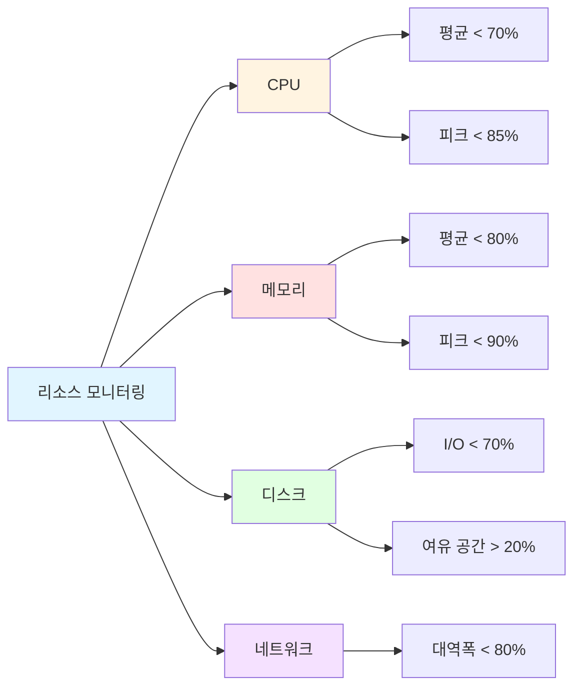
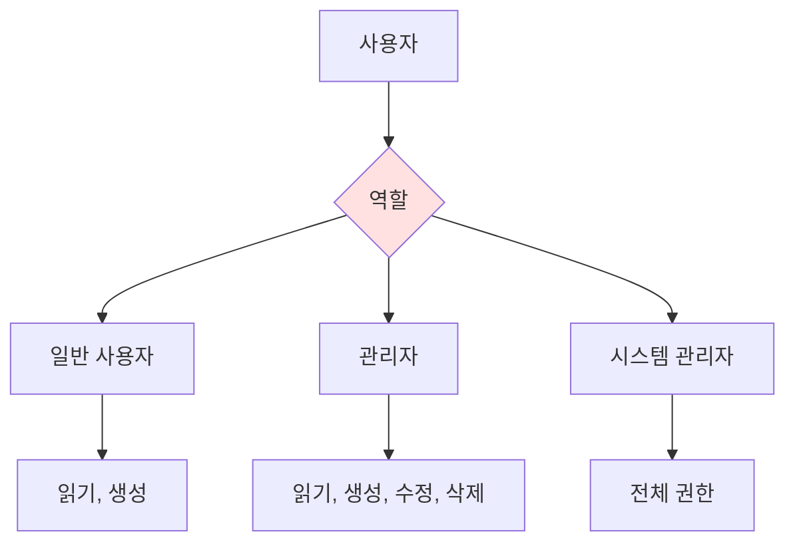

# 비기능 요구사항 (Non-Functional Requirements)
{: .no_toc }

시스템이 **어떻게** 동작해야 하는지 정의하는 문서입니다.
{: .fs-6 .fw-300 }

---

## 목차
{: .no_toc .text-delta }

1. TOC
{:toc}

---

## 개요

비기능 요구사항은 시스템의 품질 속성(Quality Attributes)을 정의하며, 성능, 보안, 확장성 등 시스템의 운영 특성을 기술합니다.

---

## 1. 성능 요구사항 (Performance)

### 1.1 응답 시간

| 작업 유형 | 목표 시간 | 최대 시간 | 측정 기준 |
|-----------|-----------|-----------|-----------|
| 페이지 로드 (React SPA) | < 1.5초 | < 3초 | 95 백분위수 |
| API 응답 (프로젝트 목록 조회) | < 200ms | < 500ms | 평균 |
| API 응답 (프로젝트 생성) | < 1초 | < 2초 | 평균 |
| GitHub Actions Workflow 생성 | < 10초 | < 20초 | 평균 |
| Jenkins Job 생성 | < 5초 | < 10초 | 평균 |
| SonarQube 프로젝트 생성 | < 8초 | < 15초 | 평균 |
| CI 상태 조회 (모든 도구) | < 3초 | < 5초 | 평균 |

### 1.2 처리량 (Throughput)

**NFR-001: API 처리량**
- **목표**: 초당 100 요청 (RPS) 처리 (MVP 범위)
- **피크**: 초당 200 요청 처리
- **측정 방법**: 부하 테스트 (k6, Gatling)
- **비고**: MVP 단계에서는 사용자 수가 제한적이므로 낮은 목표 설정

**NFR-002: 동시 사용자**
- **목표**: 동시 접속자 50명 지원 (MVP 범위)
- **피크**: 동시 접속자 100명 지원
- **세션 관리**: Keycloak 세션 + PostgreSQL
- **비고**: 향후 Redis 도입 검토

**NFR-003: CI 설정 동시 처리**
- **목표**: 동시에 최대 10개 프로젝트의 CI 설정 생성 지원
- **제약**: GitHub/Jenkins/SonarQube API Rate Limit 고려
- **처리 방식**: 비동기 Job Queue (선택적)

### 1.3 리소스 사용량



**NFR-004: CPU 사용률**
- 평균 사용률 < 60% (Docker 컨테이너 기준)
- 피크 사용률 < 80%
- CI 설정 생성 시 일시적 피크 허용

**NFR-005: 메모리 사용률**
- Backend (Spring Boot): 최대 1GB Heap
- Frontend (React): 빌드 결과물 < 5MB (gzip 압축 전)
- 메모리 누수 없음 (24시간 연속 실행)

**NFR-006: 데이터베이스 (PostgreSQL)**
- 연결 풀: 최소 5, 최대 20 (MVP 범위)
- 쿼리 실행 시간: 평균 < 100ms
- 인덱스 적용: 모든 WHERE 조건 컬럼 (user_id, project_id 등)
- 트랜잭션 타임아웃: 30초

---

## 2. 확장성 (Scalability)

### 2.1 수평 확장 (Horizontal Scaling)

**NFR-010: 무상태 설계 (Stateless)**
- 모든 애플리케이션 서버는 무상태로 설계
- 세션 데이터는 Redis에 저장
- 로드 밸런서를 통한 자동 분산

**NFR-011: 데이터베이스 샤딩**
- 사용자 ID 기반 샤딩 지원
- 100만 사용자까지 단일 DB
- 100만 이상 시 샤딩 전략 적용

### 2.2 수직 확장 (Vertical Scaling)

**NFR-012: 리소스 증설**
- CPU/메모리 증설 시 재시작 불필요
- 클라우드 인스턴스 타입 변경 지원

---

## 3. 가용성 (Availability)

### 3.1 서비스 수준 목표 (SLO)

**NFR-020: 가동 시간 (Uptime)**
- **목표**: 99.9% (연간 약 8.76시간 다운타임)
- **측정**: 월별 가동률 계산
- **제외**: 계획된 유지보수 시간

```
가동률 = (전체 시간 - 다운타임) / 전체 시간 × 100
```

### 3.2 장애 복구

**NFR-021: 복구 시간 목표 (RTO)**
- **중대 장애**: 1시간 이내 복구
- **일반 장애**: 4시간 이내 복구
- **경미한 장애**: 24시간 이내 복구

**NFR-022: 복구 시점 목표 (RPO)**
- **데이터 손실 허용 한계**: 최대 5분
- **백업 주기**: 매 1시간
- **실시간 복제**: Primary-Replica 구성

### 3.3 무중단 배포

**NFR-023: Blue-Green 배포**
- 무중단 배포 지원
- 롤백 가능 (5분 이내)
- 헬스 체크 자동화

---

## 4. 보안 (Security)

### 4.1 인증 및 인가

**NFR-030: Keycloak 기반 인증**
- OpenID Connect (OIDC) 프로토콜 사용
- 액세스 토큰 만료: 30분 (Keycloak 설정)
- 리프레시 토큰 만료: 24시간 (Keycloak 설정)
- HTTPS 필수 (프로덕션 환경)
- SSO (Single Sign-On) 지원

**NFR-031: 권한 관리**
- 역할 기반 접근 제어 (RBAC) - MVP에서는 단일 역할
- 사용자는 자신이 생성한 프로젝트만 접근 가능
- API 엔드포인트마다 인증 필수 (공개 API 제외)
- 향후 팀/조직 단위 권한 관리 확장 예정

### 4.2 데이터 보호

**NFR-032: CI 도구 토큰 암호화**
- **알고리즘**: AES-256-GCM (Galois/Counter Mode)
- **키 관리**: 환경 변수로 마스터 키 관리 (향후 KMS 검토)
- **저장**: PostgreSQL BYTEA 컬럼에 암호화된 바이너리 저장
- **복호화**: API 호출 시점에만 메모리에서 복호화
- **로깅 금지**: 복호화된 토큰은 절대 로그에 기록 불가

**NFR-033: 전송 계층 보안**
- **외부 API**: 모든 CI 도구 API 호출은 HTTPS 사용
- **프로덕션**: TLS 1.2 이상 (TLS 1.3 권장)
- **개발 환경**: HTTP 허용 (로컬 개발만)

**NFR-034: 입력 검증 및 인젝션 방지**
- **SQL Injection**: Spring Data JPA + Hibernate (Parameterized Query)
- **XSS**: React 자동 이스케이프 + DOMPurify 라이브러리 (필요 시)
- **입력 검증**: Bean Validation (@Valid, @NotNull, @Pattern 등)
- **GitHub/Jenkins URL 검증**: 화이트리스트 기반 URL 검증

**NFR-035: CSRF 방지**
- Spring Security CSRF 토큰 사용
- SameSite=Strict 쿠키 속성 (프로덕션)
- API는 토큰 기반 인증으로 CSRF 영향 최소화

### 4.3 접근 제어

**NFR-036: 역할 기반 접근 제어 (RBAC)**


**NFR-037: API Rate Limiting**
- MVP에서는 Rate Limiting 미적용 (사용자 수 제한적)
- 향후 도입 시: 사용자당 분당 100 요청
- 외부 API (GitHub/Jenkins/SonarQube) Rate Limit 고려 필요

### 4.4 감사 로그 및 모니터링

**NFR-038: 로그 기록**
- **인증 이벤트**: 모든 로그인 시도 (성공/실패)
- **CI 설정 이벤트**: 프로젝트 생성, GitHub Actions/Jenkins/SonarQube 설정 생성/수정/삭제
- **토큰 관리 이벤트**: 토큰 등록/삭제 (토큰 값은 로그에 기록 금지)
- **에러 로그**: 외부 API 호출 실패, 시스템 에러
- **로그 레벨**: ERROR, WARN, INFO, DEBUG
- **로그 형식**: JSON (구조화된 로그)
- **로그 보관 기간**: 90일 (MVP 범위)

**NFR-039: 외부 API 호출 로그**
- GitHub/Jenkins/SonarQube API 호출 기록 (요청/응답 시간, 상태 코드)
- Rate Limit 상태 모니터링
- API 토큰은 마스킹 처리 (예: gh_***)

---

## 5. 사용성 (Usability)

### 5.1 사용자 인터페이스

**NFR-040: 반응형 디자인**
- 모바일: 320px ~ 767px
- 태블릿: 768px ~ 1023px
- 데스크톱: 1024px 이상

**NFR-041: 브라우저 지원**
- Chrome 최신 버전 (우선 지원)
- Firefox 최신 버전
- Safari 최신 버전
- Edge 최신 버전
- IE 11 미지원

**NFR-042: 사용자 경험**
- 직관적인 프로젝트 생성 플로우 (3-5단계 이내)
- CI 설정 진행 상황 표시 (선택적, nice-to-have)
- 명확한 에러 메시지 및 해결 방법 안내
- GitHub/Jenkins/SonarQube 설정 상태를 시각적으로 표시

### 5.2 접근성 (Accessibility)

**NFR-043: 기본 접근성**
- 키보드 네비게이션 지원 (Tab, Enter)
- 의미 있는 HTML 시맨틱 태그 사용
- 버튼/링크에 명확한 레이블 제공
- WCAG 2.1 Level A 최소 준수 (MVP 범위)

**NFR-044: 다국어 지원**
- 한국어 (기본) - MVP에서는 한국어만 지원
- 향후 영어 지원 검토

---

## 6. 유지보수성 (Maintainability)

### 6.1 코드 품질

**NFR-050: 코드 커버리지**
- Backend (Kotlin/Spring Boot): 단위 테스트 최소 70% (MVP 범위)
- Frontend (TypeScript/React): 단위 테스트 최소 60% (MVP 범위)
- E2E 테스트: 주요 시나리오 (프로젝트 생성, CI 설정) 커버
- 향후 커버리지 목표: Backend 80%, Frontend 70%

**NFR-051: 코드 품질 기준**
- **Kotlin**: ktlint, detekt 규칙 준수
- **TypeScript**: ESLint + Prettier 규칙 준수
- Cyclomatic Complexity < 15 (MVP 허용치)
- 함수 길이 < 100줄 (MVP 허용치)

**NFR-052: 정적 분석**
- SonarQube Community Edition 사용 (자체 호스팅)
- Quality Gate: 신규 코드 기준 적용
- 중대 이슈 (Blocker, Critical) 없음
- 코드 중복률 < 5%

### 6.2 문서화

**NFR-053: API 문서**
- OpenAPI 3.0 (Swagger) 명세
- Spring Boot: SpringDoc OpenAPI 사용
- 모든 REST API 엔드포인트 문서화
- `/swagger-ui.html` 경로에서 접근 가능

**NFR-054: 코드 주석**
- Kotlin: KDoc (public 함수/클래스)
- TypeScript: JSDoc/TSDoc (public 컴포넌트/함수)
- 복잡한 비즈니스 로직: 인라인 주석
- GitHub Actions/Jenkins/SonarQube 템플릿: YAML 주석

---

## 7. 운영성 (Operability)

### 7.1 모니터링

**NFR-060: 헬스 체크**
- Spring Boot Actuator `/actuator/health` 엔드포인트
- 응답 시간 < 200ms
- 의존성 상태: PostgreSQL, Keycloak (선택적)
- Docker Compose 헬스 체크 통합

**NFR-061: 메트릭 수집 (선택적, nice-to-have)**
- Spring Boot Actuator `/actuator/metrics`
- Micrometer 라이브러리 사용
- 비즈니스 메트릭: 프로젝트 생성 수, CI 설정 성공률
- 향후 Prometheus + Grafana 통합 검토

**NFR-062: 로그 관리**
- 구조화된 로그 (Logback + JSON encoder)
- 로그 레벨: ERROR, WARN, INFO, DEBUG
- 개발 환경: 콘솔 출력
- 프로덕션: 파일 출력 + 로그 로테이션 (일별, 최대 30일)
- 향후 중앙 집중식 로그 (ELK Stack) 검토

### 7.2 알림

**NFR-063: 알림 정책 (MVP 범위 외)**
- MVP에서는 알림 기능 미제공
- 사용자는 웹 UI에서 CI 설정 상태 확인
- 향후 Slack/이메일 알림 검토

---

## 8. 호환성 (Compatibility)

### 8.1 플랫폼 호환성

**NFR-070: 운영체제 및 컨테이너**
- Docker 컨테이너 환경 (필수)
- Docker Compose 3.8+
- 호스트 OS: Linux (Ubuntu 20.04+) 또는 macOS (개발 환경)
- Windows: WSL2 환경에서 동작

**NFR-071: 데이터베이스**
- PostgreSQL 13+ (필수)
- 다른 RDBMS 미지원 (MVP 범위)

### 8.2 통합 호환성

**NFR-072: API 버전 관리**
- MVP에서는 버전 없이 `/api/...` 형식 사용
- 향후 Breaking Change 발생 시 `/api/v2/...` 도입
- OpenAPI 문서에 버전 정보 명시

**NFR-073: 외부 API 호환성**
- **GitHub API**: REST API v3 사용
- **Jenkins API**: Jenkins 2.x REST API
- **SonarQube API**: SonarQube 9.x+ Web API
- **Keycloak**: OpenID Connect 1.0 / OAuth 2.0

---

## 9. 규정 준수 (Compliance)

### 9.1 법적 요구사항 (MVP 범위 외)

**NFR-080: 개인정보보호법**
- MVP에서는 최소한의 개인정보만 수집 (Keycloak 사용자 ID, 이메일)
- 사용자 동의 절차는 Keycloak에서 처리
- 향후 별도 개인정보 처리방침 수립 필요

**NFR-081: 데이터 보관**
- MVP에서는 데이터 삭제 정책 미정의
- 사용자 탈퇴 기능 미제공 (MVP 범위)
- 향후 GDPR 등 규정 준수 검토

---

## 10. 비기능 요구사항 매트릭스

| 카테고리 | 요구사항 ID | 요구사항 | 우선순위 | 측정 방법 | 목표 값 | MVP 단계 |
|----------|-------------|----------|----------|-----------|---------|----------|
| 성능 | NFR-001 | API 처리량 | 🔴 | 부하 테스트 (k6) | 100 RPS | All |
| 성능 | NFR-003 | CI 설정 동시 처리 | 🟡 | 통합 테스트 | 10개 프로젝트 | All |
| 가용성 | NFR-020 | 가동 시간 | 🟡 | Docker 헬스 체크 | 95%+ | All |
| 보안 | NFR-030 | Keycloak 인증 | 🔴 | 통합 테스트 | OIDC 인증 | All |
| 보안 | NFR-032 | 토큰 암호화 | 🔴 | 단위 테스트 | AES-256-GCM | All |
| 보안 | NFR-034 | 입력 검증 | 🔴 | 단위 테스트 | Bean Validation | All |
| 보안 | NFR-038 | 감사 로그 | 🔴 | 로그 검증 | 모든 중요 이벤트 | All |
| 확장성 | NFR-010 | 수평 확장 | 🟢 | Docker Compose | 컨테이너 복제 가능 | Future |
| 사용성 | NFR-040 | 반응형 디자인 | 🟡 | 수동 테스트 | 모바일~데스크톱 | All |
| 사용성 | NFR-042 | 사용자 경험 | 🔴 | 사용자 테스트 | 3-5단계 플로우 | All |
| 유지보수성 | NFR-050 | 코드 커버리지 | 🟡 | JaCoCo, Jest | Backend 70%, FE 60% | All |
| 유지보수성 | NFR-052 | 정적 분석 | 🔴 | SonarQube | 중대 이슈 없음 | All |
| 유지보수성 | NFR-053 | API 문서 | 🔴 | OpenAPI 검증 | 모든 API 문서화 | All |
| 운영성 | NFR-060 | 헬스 체크 | 🔴 | Actuator 호출 | < 200ms 응답 | All |
| 운영성 | NFR-062 | 로그 관리 | 🔴 | 로그 검증 | JSON 구조화 로그 | All |
| 호환성 | NFR-070 | Docker 환경 | 🔴 | Docker Compose | 컨테이너 실행 | All |
| 호환성 | NFR-073 | 외부 API 호환성 | 🔴 | 통합 테스트 | GitHub/Jenkins/SQ API | All |

---

## ✅ 완료 체크리스트

- [ ] 성능 목표 수치 정의 완료
- [ ] 보안 요구사항 명세 완료
- [ ] 가용성 SLO 정의 완료
- [ ] 모니터링 전략 수립 완료
- [ ] 규정 준수 항목 확인 완료
- [ ] 이해관계자 리뷰 완료

---

**다음 단계**: [제약사항](constraints/) 작성
